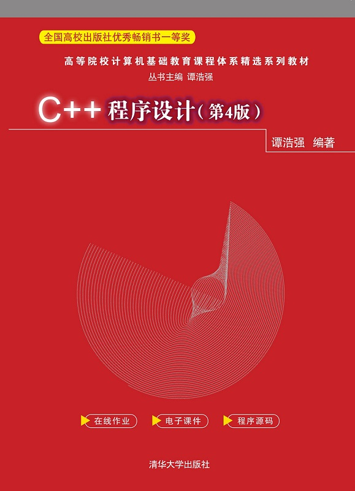

# Textbooks, 教材
{: .no_toc }

## Table of Contents
{: .no_toc .text-delta }

1. TOC
{:toc}

-   [谭浩强.C++程序设计:第4版[M].北京:清华大学出版社,2021.](http://www.tup.tsinghua.edu.cn/booksCenter/book_09067402.html)

	

---

Last Updated: Sat Nov  9 11:07:50 CST 2024
