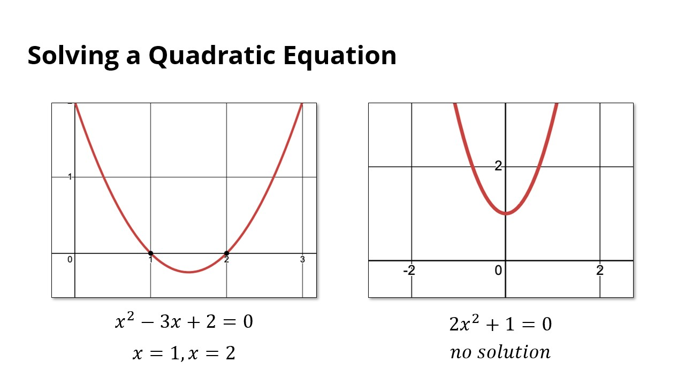
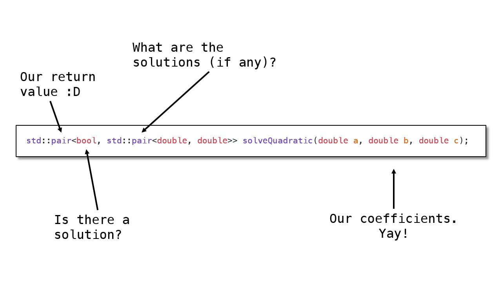
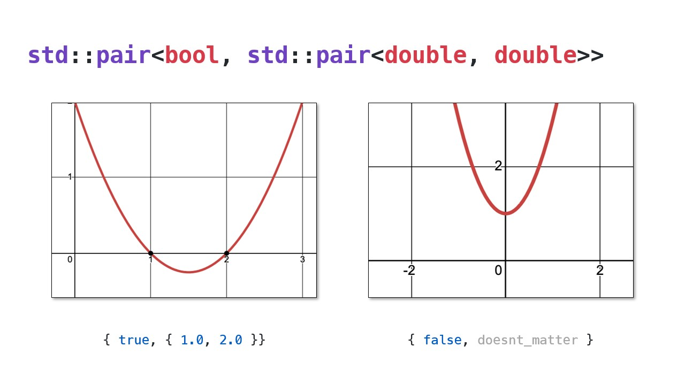

# Quadratic Equation



- If we have $ax^2+bx+c=0$
- Solutions are $x=\frac{-b\pm\sqrt{b^2-4ac}}{2a}$
- If $b^2-4ac$ is negative, there are no solutions





- **Task**: Write a function to solve a quadratic equation
	- The `sqrt` function from the `<cmath>` header can calculate the square root

```cpp
std::pair<bool, std::pair<double, double>>  solveQuadratic(double a, double b, double c);
```

