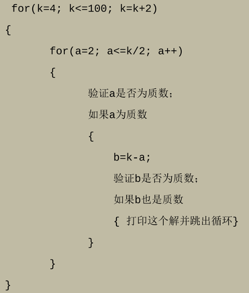

{: .warning-title }
> 截止时间
> 
> Due by 11:59 p.m. on Sunday, October 13.
> 
> Lab 2 的实验报告、程序代码的提交截止时间是：10.13 11:59 p.m. (周日)。
> 
> (请在指定截止时间前提交，过期提交链接会失效！)

# Lab 2: C++循环 ([Lab2报告模版](https://znas.cn/AppH5/share/?nid=KEYDEMJQGA2DCRKHGJBTS&code=6lX86Ttcl3LxvVEw0FgZfcNSnVZToI1lWy3lFdm1NcdFKuhdNrgoHKaDhkCzGHiYD&mode=file&display=list))
{: .no_toc }

## Table of Contents
{: .no_toc .text-delta }

1. TOC
{:toc}

## 实验内容
### Q1: Primes, 素数

{: .note-title }
> 命名规范
>
> 程序取名：`primes.cpp`

求2~100之间的所有素数。
#### Input

无。

#### Output

每个素数输出一行：

```
2
3
...
```

### Q2: Goldbach's Conjecture, 哥德巴赫猜想

{: .note-title }
> 命名规范
>
> 程序取名：`goldbach.cpp`

验证哥德巴赫猜想，任一大于 2 的偶数都可写成两个质数之和。

通过程序在4～100内验证这个猜想，以下为程序算法：


#### Input

无。
#### Output

```
4=2+2
...
```

## 提交说明

1. [【实验报告】提交链接](https://znas.cn/AppH5/share/collection?code=6lX86Ttcl3LxvVEw0FgZffocoQw0zlIYMF4TtWtJibUzNjVGIWxqeBsfNpF28xdk&nid=KEYDEMJQGA2DCRKHGJBTS&mode=file&display=list&type=3)
2. [【程序代码】提交链接](https://znas.cn/AppH5/share/collection?code=6lX86Ttcl3LxvVEw0FgZfTlm2DUDJUC9am2XKWpASm2RxDnnqQdm2m1nGrOsVcl2QEIfa&nid=KEYDEMJQGA2DCRKHGJBTS&mode=file&display=list&type=3)

## 评分标准 (暂无)

---

Last Updated: Wed Oct  9 15:30:10 CST 2024


