# Lab 0: 配置 C++ 开发环境
{: .no_toc }

## Table of Contents
{: .no_toc .text-delta }

1. TOC
{:toc}

- [Dev-C++](https://sourceforge.net/projects/orwelldevcpp/) (Windows)
	- 介绍 & 教程：[https://oi-wiki.org/tools/editor/devcpp/](https://oi-wiki.org/tools/editor/devcpp/)
	- 环境配置：[http://www.codelearn.club/2022/11/devcpp/](http://www.codelearn.club/2022/11/devcpp/)
- [Visual Studio Code](https://code.visualstudio.com/) (Windows & macOS)
	- 介绍 & 教程：[https://oi-wiki.org/tools/editor/vscode/](https://oi-wiki.org/tools/editor/vscode/)
- [Visual Studio](https://visualstudio.microsoft.com/zh-hans/) (Windows & macOS)

对工具软件感兴趣的同学，更多资料可以参考：[https://oi-wiki.org/tools/](https://oi-wiki.org/tools/)。

---

## Windows (Lab 5 环境配置教程)

### 第 1 步：安装 Python (测试环境需要)

- [Python 下载链接](https://www.python.org/downloads/release/python-3130/)

---

1. 点击上方下载链接，在页面的最下方选择对应的版本进行下载，一般是 `Windows installer (64-bit)`。


2. 下载完成后，双击如下安装向导：


3. 首先勾选 “Use admin privileges when installing py.exe”（可选）和 “Add python.exe to PATH”（必选）。然后单击“Install Now”，安装到默认位置。也可以根据自己的情况，自定义安装的位置和其他选项。
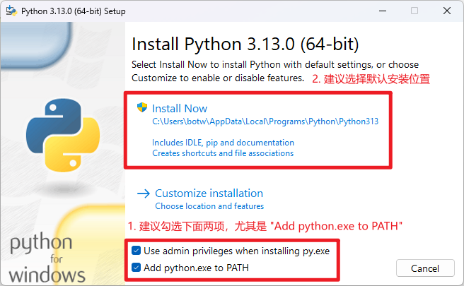

4. 安装过程：
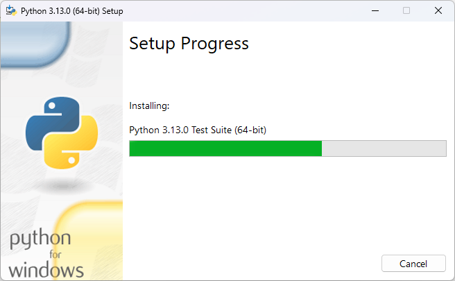

5. 成功安装后会显示如下界面：
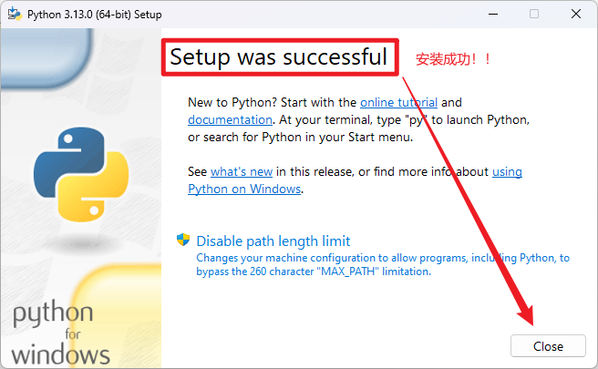

6. 打开 cmd，输入 `python` ，如果出现 `>>>` 则表示 Python 已经成功安装。随后关闭 cmd 即可。
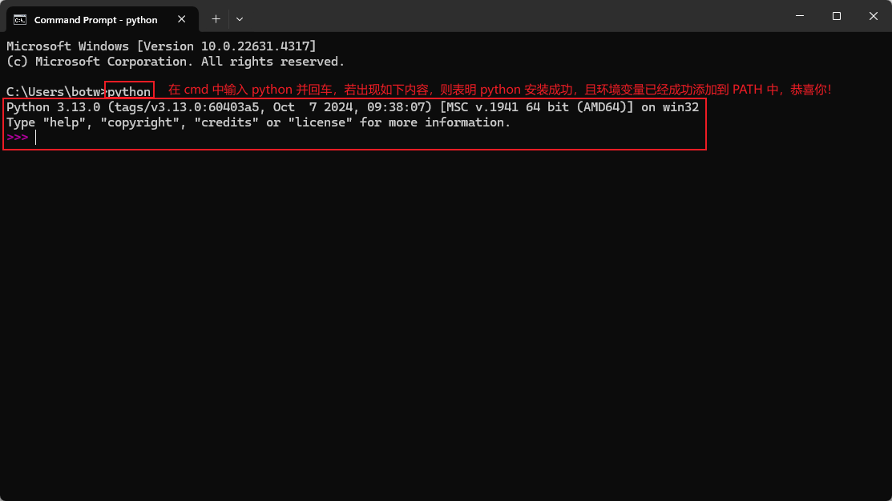

### 第 2 步：安装 VSCode (方便执行编译命令)

- [VSCode 下载链接](https://code.visualstudio.com/)

---

1. 点击上方下载链接，下载完成后得到如下安装程序。


2. 运行安装程序并按照安装向导的步骤进行操作。
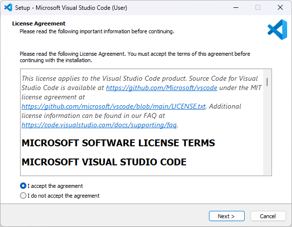

3. 在向导中，选择想要安装的文件夹位置。
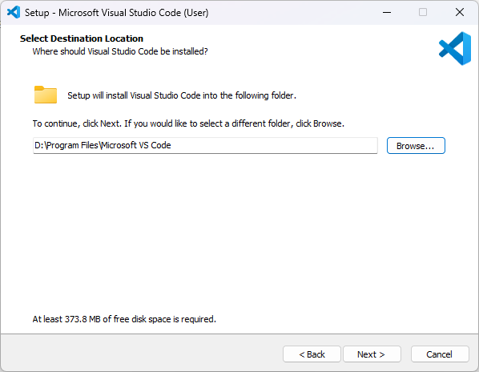

4. 选择是否在开始菜单创建快捷方式：
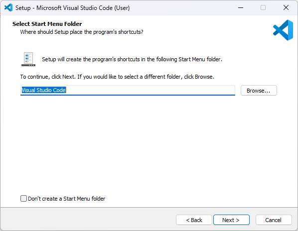

5. 配置项，建议全部勾选：
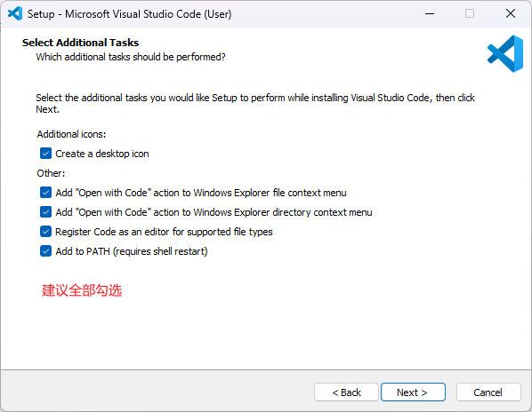

6. 安装成功。


8. 打开VSCode，点击左侧的“扩展”选项卡，在搜索框里搜索“C++”，然后安装下图所示的扩展插件。
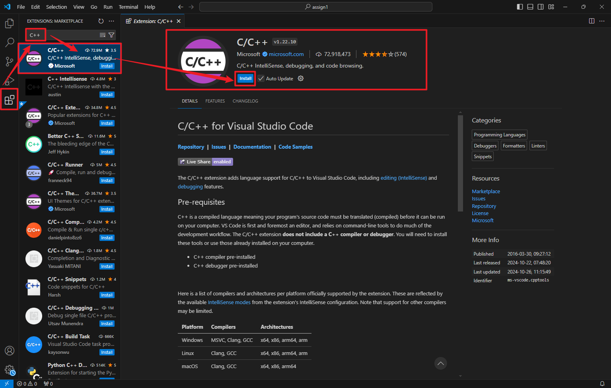

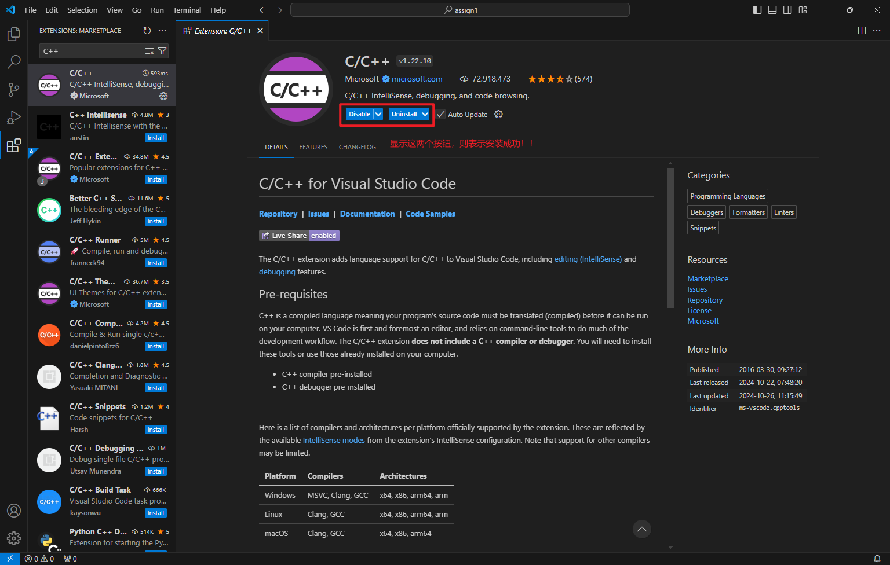

9. 可选：安装 C/C++ Extension Pack。
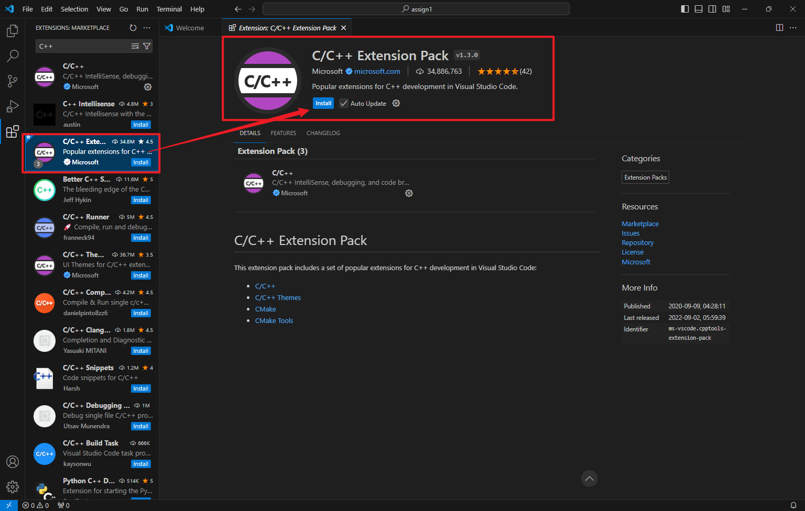

### 第 3 步：使用 MSYS2 安装 MinGW-w64 工具链 (编译需要)

- [MSYS2 下载链接](https://github.com/msys2/msys2-installer/releases/download/2024-01-13/msys2-x86_64-20240113.exe)

1. 点击上方下载链接，下载完成后得到如下安装程序：


2. 运行安装程序并按照安装向导的步骤进行操作。（注意，MSYS2 仅支持 64 位的 Windows 8.1 或更高版本。）
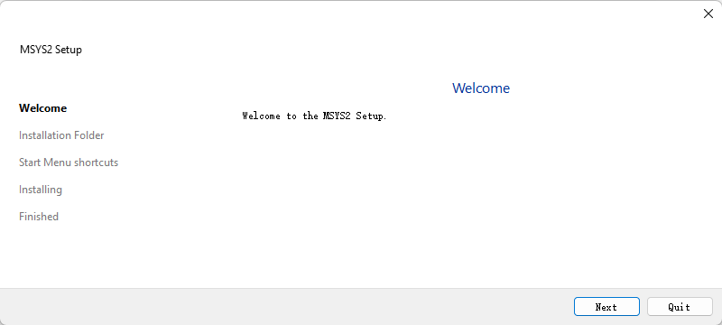

3. 在向导中，选择想要安装的文件夹位置，并记录该目录以备后用（配置环境变量）。大多数情况下，推荐的安装目录是合适的。
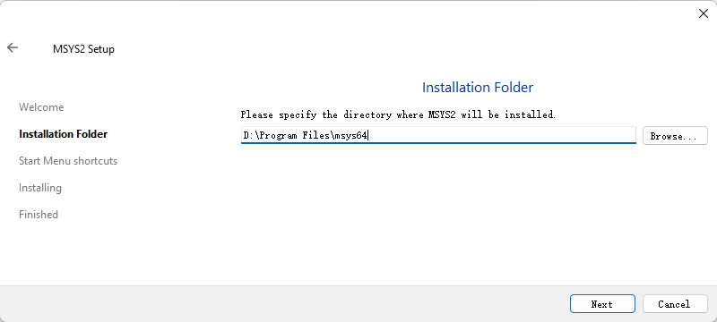

4. 进入设置开始菜单快捷方式的步骤，同样使用默认选项。
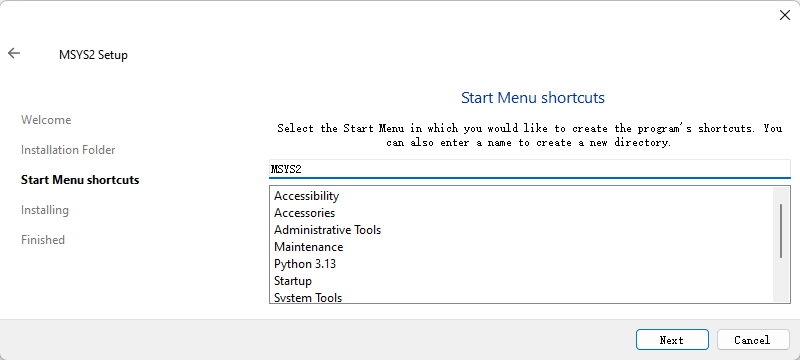

5. 安装过程。
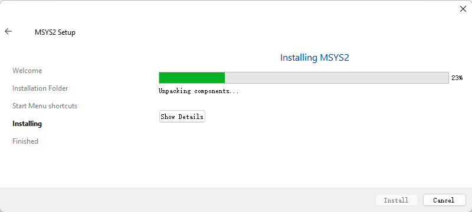

6. 安装完成后，确保“运行 MSYS2”选项已选中，然后点击“完成”。此操作将会打开一个 MSYS2 终端窗口。
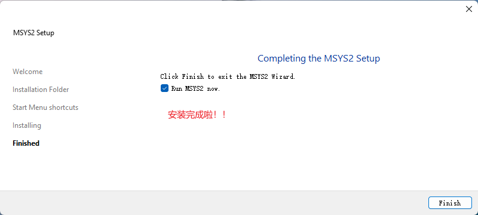

7. 打开的 MSYS2 终端窗口：
   
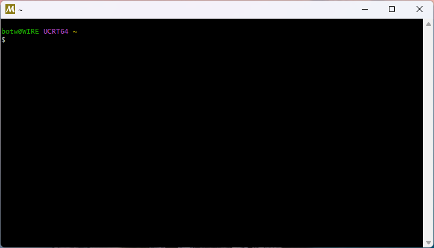

8. 在该终端窗口中，运行以下命令以安装 MinGW-w64 工具链：

   ```bash
   pacman -S --needed base-devel mingw-w64-ucrt-x86_64-toolchain
   ```

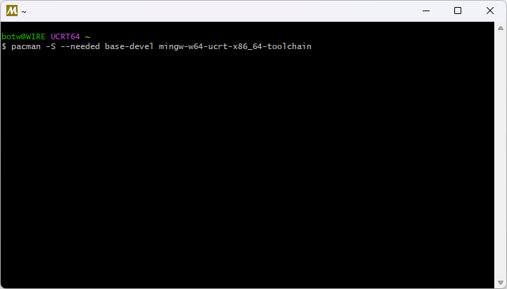

9. 按下 Enter 键，接受工具链组中默认的包数量。

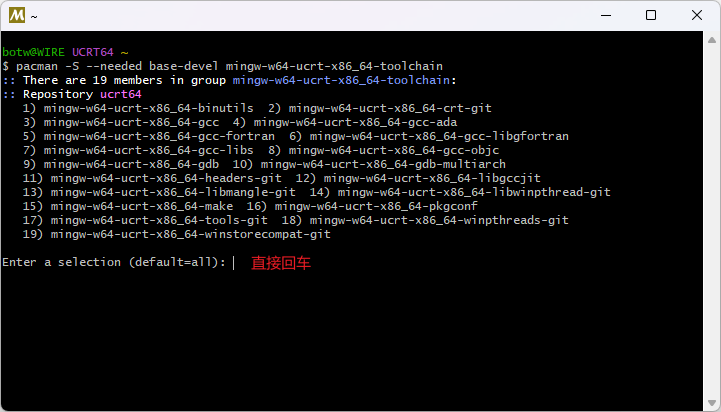

10. 当提示是否继续安装时，输入 `Y` 并按下 Enter 键。

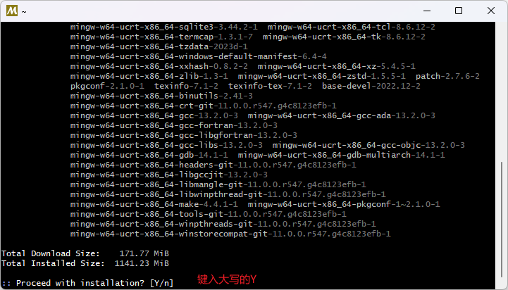

11. MinGW-w64 工具链安装完成。
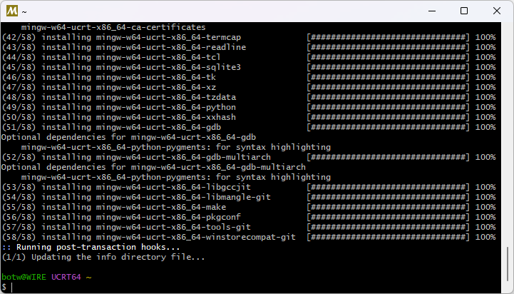

12. 测试 Python 和 g++ 是否已经成功安装，并配置了环境变量。
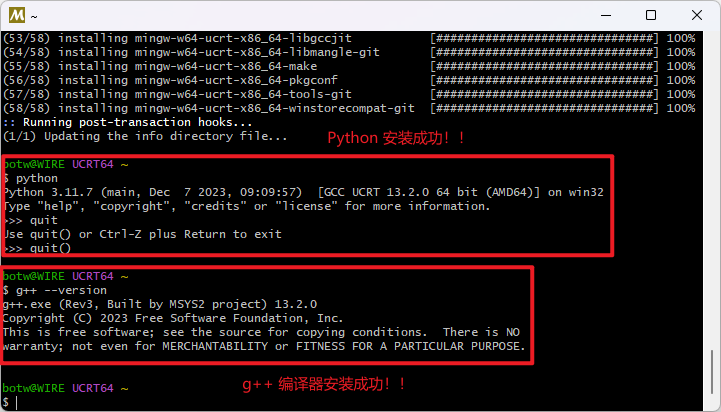

13. 将 MinGW-w64 的 `bin` 文件夹路径添加到 Windows 的 PATH 环境变量中，步骤如下：

   - 在 Windows 搜索栏中，输入“设置”以打开 Windows 设置。
   - 搜索“为您的帐户编辑环境变量”。
   - 在“用户变量”中，选择 Path 变量，然后点击“编辑”。
   - 点击“新建”，并将安装过程记录的 MinGW-w64 路径添加到列表中。如果您使用了默认设置，路径为：`C:\msys64\ucrt64\bin`。
   - 点击“确定”，然后再次点击“确定”以更新 PATH 环境变量。请重新打开所有控制台窗口，使更新后的 PATH 环境变量生效。

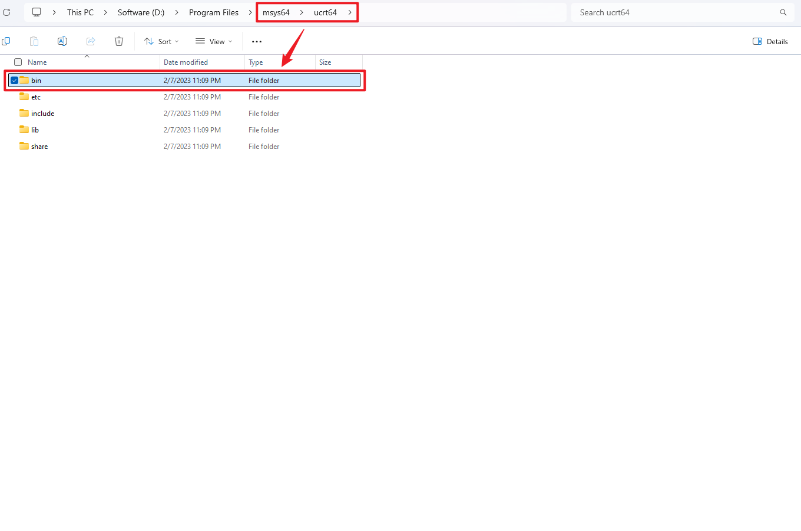


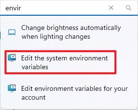

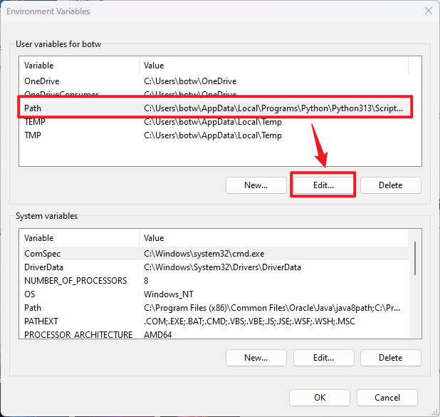

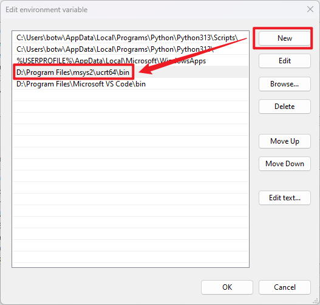

---

Last Updated: Sun Oct 27 21:44:07 CST 2024


