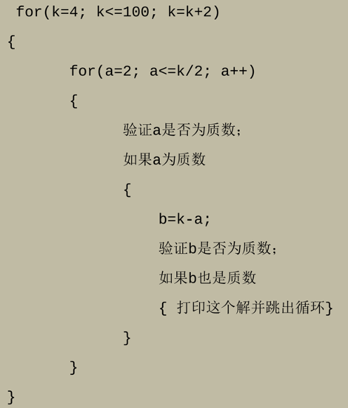

{: .warning-title }
> 截止时间
> 
> Due by 11:59 p.m. on Sunday, October 13.
> 
> Lab 2 的实验报告、程序代码的提交截止时间是：10.13 11:59 p.m. (周日)。
> 
> (请在指定截止时间前提交，过期提交链接会失效！)

# Lab 2: C++循环 ([Lab2报告模版](https://znas.cn/AppH5/share/?nid=KEYDEMJQGA2DCRKHGJBTS&code=6lX86Ttcl3LxvVEw0FgZfVkm2rB5Dm3aCzKm1UyyGo4qaVWQqOfzN6x5pIVXSjztIYi&mode=file&display=list))
{: .no_toc }

## Table of Contents
{: .no_toc .text-delta }

1. TOC
{:toc}

## 实验内容
### Q1: Primes, 素数 (4分)

{: .note-title }
> 命名规范
>
> 程序取名：`primes.cpp`

求2~100之间的所有素数。
#### Input

无。

#### Output

每个素数输出一行：

```
2
3
...
```

#### Solution

```cpp
/*
 * File: primes.cpp
 * -----------------------------
 * This program prints all prime numbers between 2 and 100.
 * Prime numbers are only divisible by 1 and themselves.
 *
 * 本程序输出 2 到 100 之间的所有素数。
 * 素数只能被 1 和自身整除。
 */

#include <iostream>
using namespace std;

/* Function prototype 函数原型 */
bool isPrime(int n); // Checks if a number is prime 检查一个数是否为素数

/* Main program 主程序 */
int main() {
    // Iterate through numbers from 2 to 100 and print the prime numbers
    // 遍历从 2 到 100 的所有数，并输出素数
    const int UPPER_LIMIT = 100;  // Define upper limit as 100 定义上限为 100
    for (int num = 2; num <= UPPER_LIMIT; num++) {
        if (isPrime(num)) {  // If the number is prime, print it 如果是素数则输出
            cout << num << endl;
        }
    }

    return 0;
}

/*
 * Function: isPrime
 * ------------------
 * Returns true if the given number n is a prime number, otherwise returns false.
 * A prime number is only divisible by 1 and itself.
 *
 * 如果给定的数字 n 是素数，则返回 true，否则返回 false。
 * 素数只能被 1 和自身整除。
 */
bool isPrime(int n) {
    if (n < 2) return false;  // Numbers less than 2 are not prime 小于 2 的数不是素数

    // Only check for divisors up to sqrt(n) to improve efficiency
    // 只需检查到 sqrt(n) 以内的除数来提高效率
    for (int divisor = 2; divisor * divisor <= n; divisor++) {
        if (n % divisor == 0) return false;  // If divisible, it's not a prime 如果能整除，则不是素数
    }

    return true;  // If no divisors are found, it's a prime 如果没有找到除数，则为素数
}
```

### Q2: Goldbach's Conjecture, 哥德巴赫猜想 (5分)

{: .note-title }
> 命名规范
>
> 程序取名：`goldbach.cpp`

验证哥德巴赫猜想，任一大于 2 的偶数都可写成两个质数之和。

通过程序在4～100内验证这个猜想，以下为程序算法：


#### Input

无。
#### Output

```
4=2+2
...
```

#### Solution

```cpp
/*
 * File: goldbach.cpp
 * -----------------------------
 * This program verifies the Goldbach Conjecture for even numbers between 4 and 100.
 * The conjecture states that every even number greater than 2 can be expressed
 * as the sum of two prime numbers.
 *
 * 本程序验证 4 到 100 之间的偶数是否符合哥德巴赫猜想。
 * 哥德巴赫猜想认为，任何大于 2 的偶数都可以表示为两个素数之和。
 */

#include <iostream>
using namespace std;

/* Function prototype 函数原型 */
bool isPrime(int n); // Checks if a number is prime 检查一个数是否为素数

/* Main program 主程序 */
int main() {
    const int UPPER_LIMIT = 100; // Define the upper limit 定义上限为 100

    // Loop through even numbers from 4 to 100
    // 遍历从 4 到 100 的所有偶数
    for (int evenNum = 4; evenNum <= UPPER_LIMIT; evenNum += 2) {
        // Check pairs of prime numbers whose sum equals the current even number
        // 检查一对素数，它们的和等于当前的偶数
        for (int prime1 = 2; prime1 <= evenNum / 2; prime1++) {
            int prime2 = evenNum - prime1;  // Calculate the complementary prime 计算对应的第二个素数

            if (isPrime(prime1) && isPrime(prime2)) {
                // If both numbers are prime, print the result and stop further checks
                // 如果两个数都是素数，输出结果并停止进一步检查
                cout << evenNum << "=" << prime1 << "+" << prime2 << endl;
                break; // Since one valid pair is found, no need to check further 找到一组有效组合后停止检查
            }
        }
    }

    return 0;
}

/*
 * Function: isPrime
 * ------------------
 * Returns true if the given number n is a prime number, otherwise returns false.
 * A prime number is only divisible by 1 and itself.
 *
 * 如果给定的数字 n 是素数，则返回 true，否则返回 false。
 * 素数只能被 1 和自身整除。
 */
bool isPrime(int n) {
    if (n < 2) return false;  // Numbers less than 2 are not prime 小于 2 的数不是素数

    // Only check for divisors up to sqrt(n) to improve efficiency
    // 只需检查到 sqrt(n) 以内的除数来提高效率
    for (int divisor = 2; divisor * divisor <= n; divisor++) {
        if (n % divisor == 0) return false;  // If divisible, it's not a prime 如果能整除，则不是素数
    }

    return true;  // If no divisors are found, it's a prime 如果没有找到除数，则为素数
}
```

## 提交链接

1. [【实验报告】提交链接](https://znas.cn/AppH5/share/collection?code=6lX86Ttcl3LxvVEw0FgZffocoQw0zlIYMF4TtWtJibUzNjVGIWxqeBsfNpF28xdk&nid=KEYDEMJQGA2DCRKHGJBTS&mode=file&display=list&type=3)
2. [【程序代码】提交链接](https://znas.cn/AppH5/share/collection?code=6lX86Ttcl3LxvVEw0FgZfTlm2DUDJUC9am2XKWpASm2RxDnnqQdm2m1nGrOsVcl2QEIfa&nid=KEYDEMJQGA2DCRKHGJBTS&mode=file&display=list&type=3)

## 评分标准

- Q1: 4分
- Q2: 5分
- 总结：1分
	- 无字数要求，有体会就多写，没感觉就少写
	- 但尽量不要使用空话、套话
	- 主要可以写写自己在调试中遇到了什么问题，自己是如何解决的，或者写写优化的思路，如何改进能够提高程序的运行效率

---

Last Updated: Wed Oct  9 16:23:22 CST 2024


