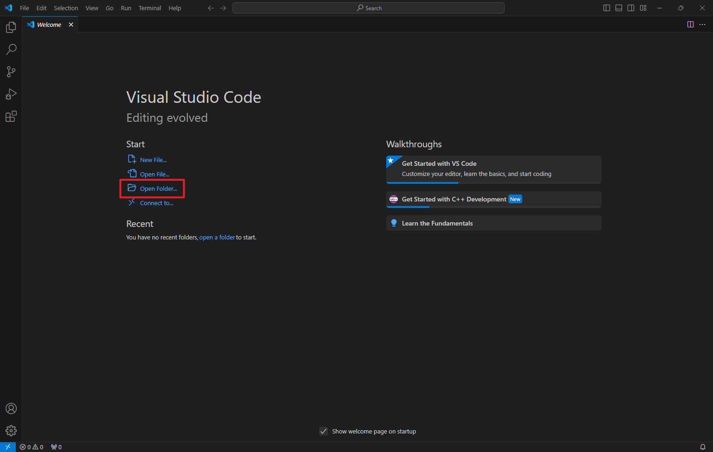
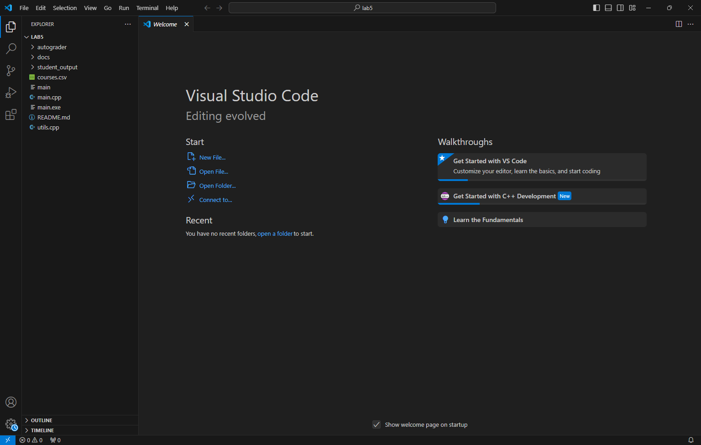
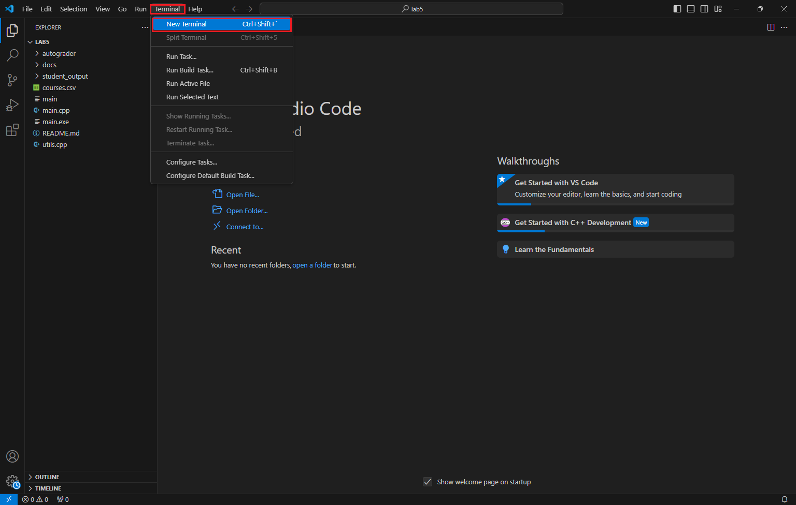
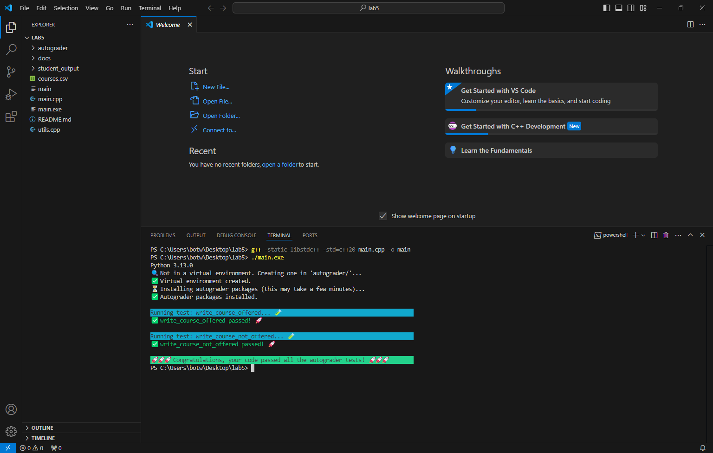

{: .warning-title }
> 截止时间
> 
> Lab 5 的实验报告、程序代码的提交截止时间是：11.03 11:59 p.m. (周日)。

# Lab 5: SimpleEnroll \[[初始代码](https://znas.cn/AppH5/share/?nid=KEYDEMJQGA2DCRKHGJBTS&code=q1UQP6vKHKwLn1f0m16ksqBonDVQrYKuWGPDyu750e01c8ESezenhm2m2wv94FFOk75&mode=file&display=list)\] \[实验报告\]
{: .no_toc }

## Table of Contents
{: .no_toc .text-delta }

1. TOC
{:toc}

{: .highlight-title}
> Lab 5 改编自 [Stanford CS107L Standard C++ Programming Assignment 1](https://github.com/cs106l/cs106l-assignments/blob/main/assign1/README.md)。

## 概览

又到了学期初使用SimpleEnroll的时候 🤗 ！在大家的学习生涯中，每个人都会意识到，最终都要毕业——所以选课变成了一项战略性任务，既要尽量多修学分，也要确保每天睡眠不少于4小时！

在这个希望不会太长的作业中，我们将利用ExploreCourses API的数据，找出今年在ExploreCourses上开设的CS课程，以及哪些未开设的课程！我们将使用流操作，同时练习C++中的初始化和引用。让我们开始吧 ʕ•́ᴥ•̀ʔっ

你只需关注两个文件：

* `main.cpp`：所有代码都写在这里 😀！
* `utils.cpp`：包含一些实用函数。你需要使用此文件中的函数，但不需要修改它。

请在标题处下载初始代码。

## 运行代码

要运行代码，首先需要编译它。打开终端（如果使用VSCode，可以按 `Ctrl+\` 或点击顶部的 **Terminal > New Terminal**）。然后确保在 `lab5/` 目录下，执行以下命令：

```sh
g++ -std=c++20 main.cpp -o main
```

假设代码没有编译错误，现在可以执行以下命令：

```sh
./main
```

这将运行 `main.cpp` 中的 `main` 函数，执行代码并启动自动评分程序检查代码是否正确。

在完成以下步骤时，建议不时地编译和使用自动评分程序，以确保进展顺利！

> [!注意]  
> ### Windows 提示
> 在Windows系统中，可能需要使用以下命令编译代码：
> ```sh
> g++ -static-libstdc++ -std=c++20 main.cpp -o main
> ```
> 以查看输出。此外，生成的可执行文件可能名为 `main.exe`，此时需运行以下命令：
> ```sh
> ./main.exe
> ```









## Part 0: 阅读代码并完善 `Course` 结构体

1. 在本次作业中，我们将使用 `Course` 结构体表示从 ExploreCourses 提取的数据记录。查看 `main.cpp` 中 `Course` 结构体的定义并补充字段的数据类型。最终我们将使用流生成 `Course` —— 还记得流处理哪些数据类型吗？
2. 查看 `main.cpp` 中的 `main` 函数，注意 `courses` 如何传递到 `parse_csv`、`write_courses_offered` 和 `write_courses_not_offered` 中。思考这些函数的功能。是否需要更改函数定义？提示一下，确实需要。

## Part 1: `parse_csv`

查看 `courses.csv` 文件，它是一个包含三列的CSV文件：Title、Number of Units和Quarter。实现 `parse_csv` 函数，使得对于CSV文件中的每一行，创建一个包含Title、Number of Units和Quarter的 `Course` 结构体。

几个需要思考的问题：
1. 如何读取 `courses.csv` 文件？或许用流操作 😏？
2. 如何逐行读取文件？

### 提示

1. 查看 `utils.cpp` 中提供的 `split` 函数，可能会派上用场！
    * 欢迎查看 `split` 的实现，它使用的是 `stringstream`，应该是可以理解的。
2. 每**行**是一个记录！*这一点很重要，所以我们再次强调 :>)*
3. 在CSV文件中（特别是 `courses.csv` 文件），第一行通常是列名定义行（表头行，或者说标题行）。这行实际上并不对应一个 `Course`，所以你需要跳过它！

## Part 2: `write_courses_offered`

OK，现在你已经有了一个 `courses` vector，里面存放了 `courses.csv` 文件中的所有记录，每条记录都存储在一个 `Course` 结构体中！假定你只对开设了的课程感兴趣。**如果某课程的 `quarter` 字段不等于字符串 `"null"`，则该课程已开设。** 在这个函数中，将所有 `quarter` 字段不为 `"null"` 的课程写入 `“student_output/courses_offered.csv”` 文件。

> [!重要]  
> 在写入CSV文件时，请遵循以下格式：
> 
> `<Title>,<Number of Units>,<Quarter>`
> 
> 请注意，逗号之间**没有空格**！如果不符合该格式，自动评分程序将不认可。
> 此外，**确保在输出文件的第一行写入标题行**。这与上一步中在 `courses.csv` 文件中需要跳过标题行相同！

`write_courses_offered` 函数执行完毕后，我们希望所有开设的课程（也就是写入到输出文件中的课程）将从 `all_courses` vector 中移除。**这意味着该函数执行后，`all_courses` 中应该仅包含未开设的课程！**

一种实现方法是使用另一个 vector 记录已开设课程，并从 `all_courses` 中删除它们。与Python和许多其他语言一样，在遍历时删除元素并不是个好主意，所以可能需要在把所有开设课程写入文件后执行删除操作。

## Part 3: `write_courses_not_offered`

什么，你对未开设的课程更感兴趣？

在 `write_courses_not_offered` 这个函数中，将 `unlisted_courses` 中的课程写入 `“student_output/courses_not_offered.csv”` 文件。因为在上一步中已删除了开设的课程，`unlisted_courses` 里面自然只包含未开设的课程——真是省心呢。

Part 3 与 Part 2 类似，但更简单些。

## 🚀 提交说明

编译并运行代码后，如果自动评分程序的输出如下所示：


那么恭喜你完成了作业！

## 提交链接

1. [【实验报告】提交链接](https://znas.cn/AppH5/share/collection?code=6lX86Ttcl3LxvVEw0FgZfb2tm25Zjd0X0uAsRiqpcrH2O6n5PqoqlWRSkgAcqgKM3&nid=KEYDEMJQGA2DCRKHGJBTS&mode=file&display=list&type=3)
2. [【程序代码】提交链接](https://znas.cn/AppH5/share/collection?code=6lX86Ttcl3LxvVEw0FgZfTAEzDoECL5I0R6OoJbQHm2fN7UNyiYiv9Zd1kRm3yetgT&nid=KEYDEMJQGA2DCRKHGJBTS&mode=file&display=list&type=3)

---

Last Updated: Sat Oct 26 21:29:08 CST 2024


