# Pointers & Memory, 指针 & 内存

- An **iterator** points to a **container element**
- A **pointer** points to **any object**

## Memory

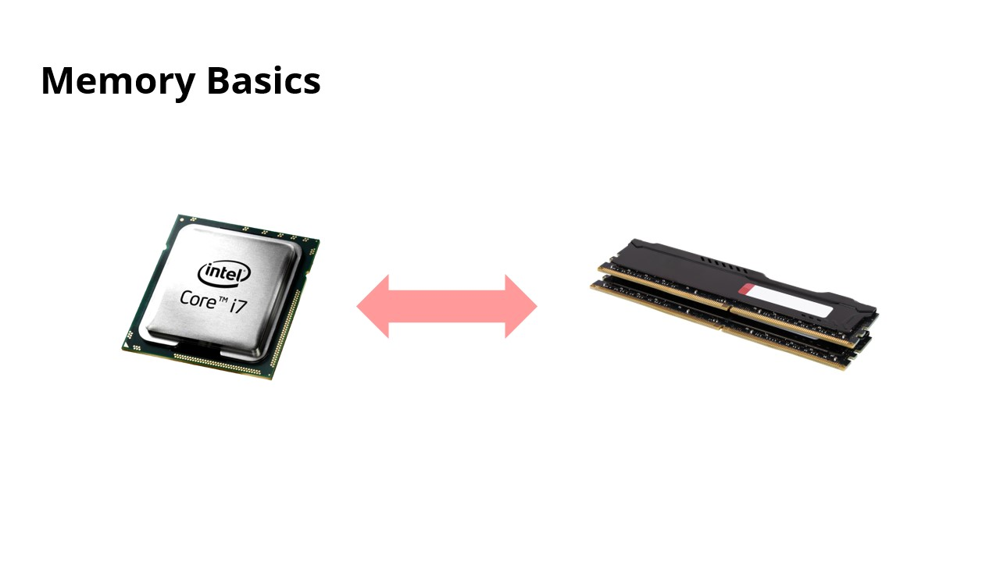

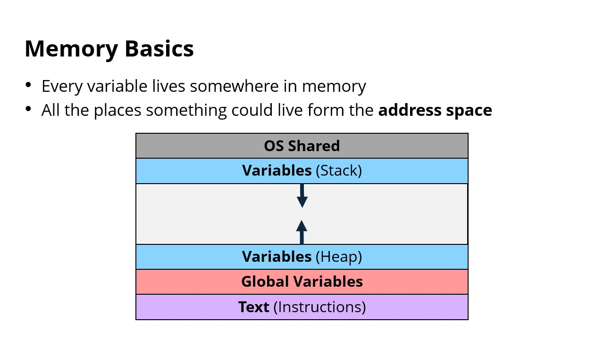

- Every variable lives somewhere in memory
- All the places something could live from the address space
	- **OS Shared**
	- **Variables** (Stack)
	- **Variables** (Heap)
	- **Global Variables**
	- **Text** (Instructions)

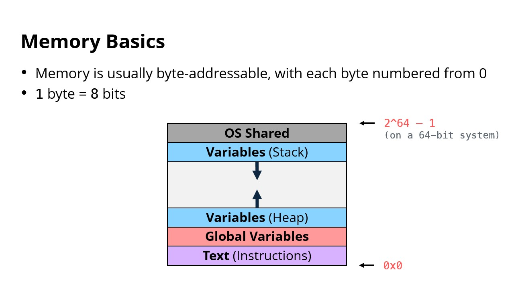

- Memory is usually byte-addressable, with each byte numbered from 0
- 1 byte = 8 bits

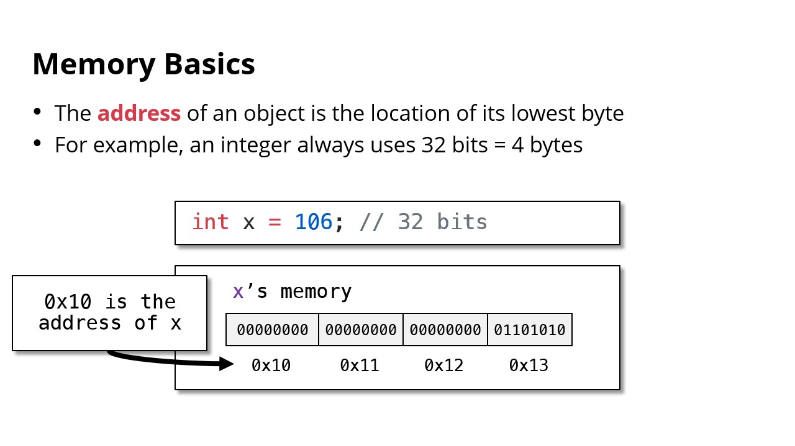

- The **address** of an object is the location of its lowest byte
- For example an integer always uses 32 bits = 4 bytes

```cpp
int x = 106; // 32 bits = 4 bytes
```

---

- **Q: How do we get the address of a variable in C++?**
- **A: Pointers!**

---

## Pointer

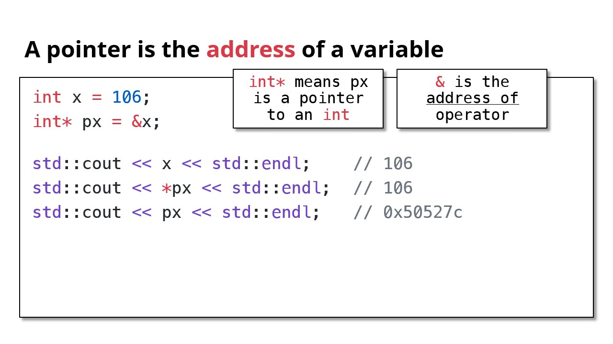

- A pointer is the **address** of a variable
- `int*` means px is a pointer to an int
- `&` is the address of operator

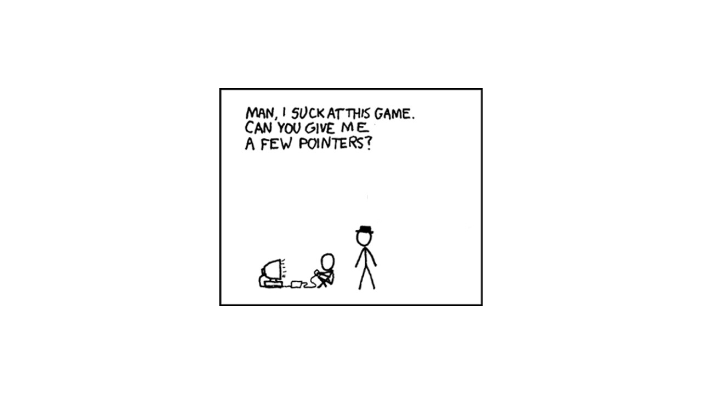

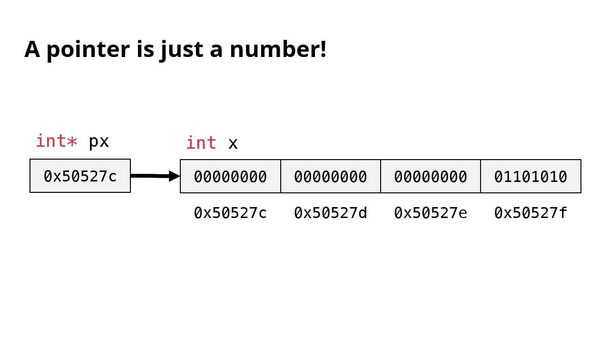

- A pointer is just a number

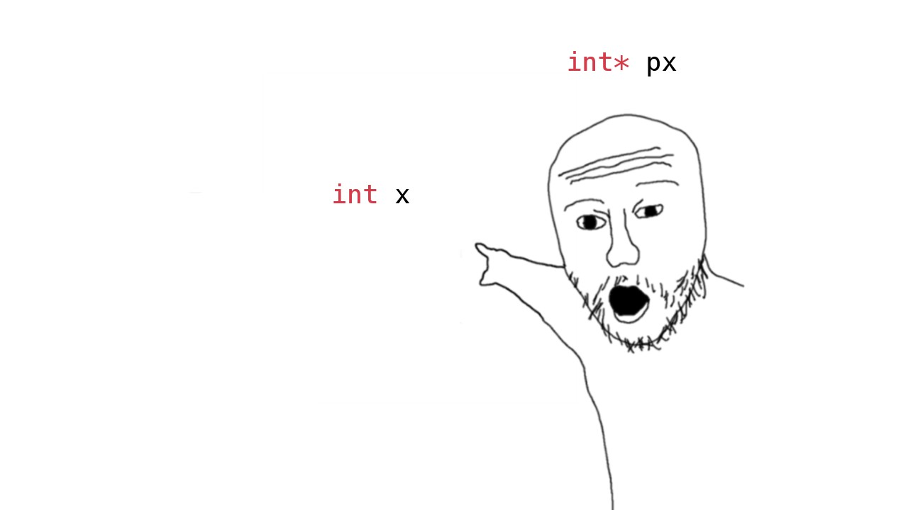

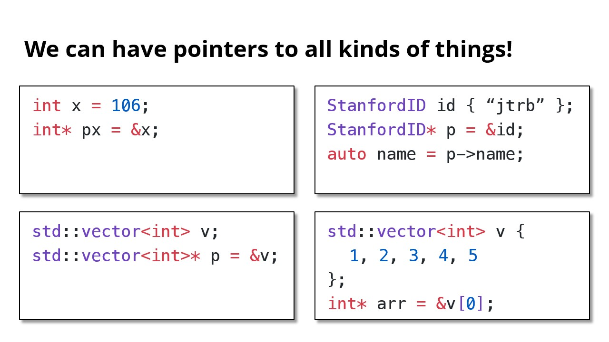

### TBD

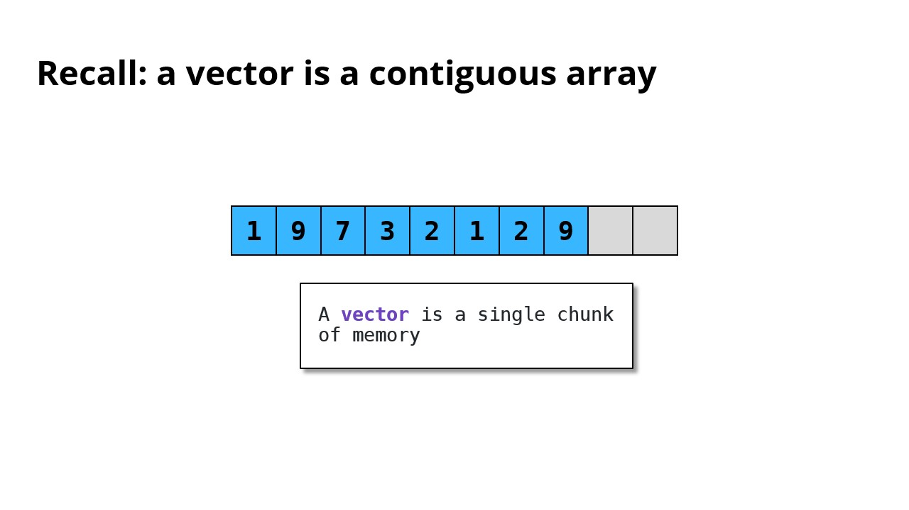

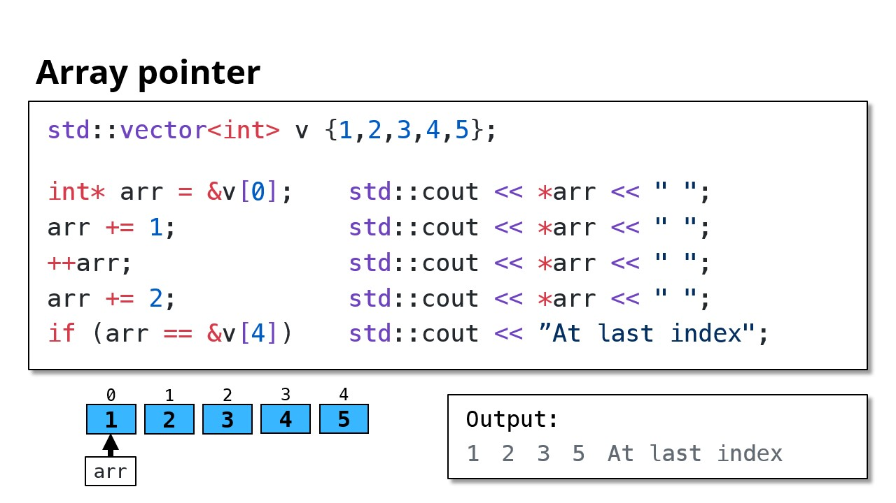
```cpp
std::vector<int> v {1,2,3,4,5};

int* arr = &v[0];   std::cout << *arr << " ";
arr += 1;           std::cout << *arr << " ";
++arr;              std::cout << *arr << " ";
arr += 2;           std::cout << *arr << " ";
if (arr == &v[4])   std::cout << "At last index";
```

```cpp
std::vector<int> v {1,2,3,4,5};

int* arr = &v[0];   // Copy constrcution
arr += 1;           // Random access
++arr;              // Move pointer forward
arr += 2;           // Random access
if (arr == &v[4])   // Pointer comparison
```

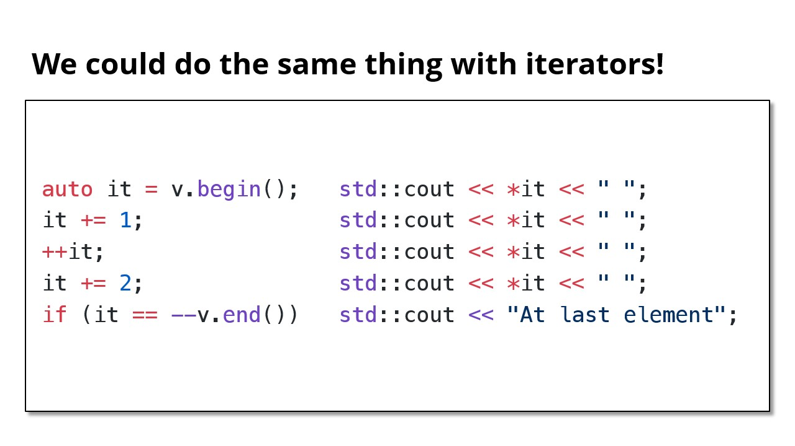

- **Iterators** have a similar interface to **pointers**

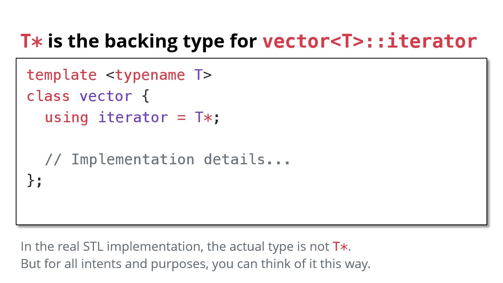

---

Last Updated: Fri Oct 25 13:54:33 CST 2024

