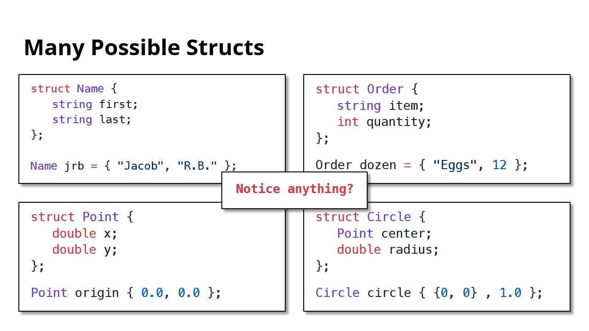
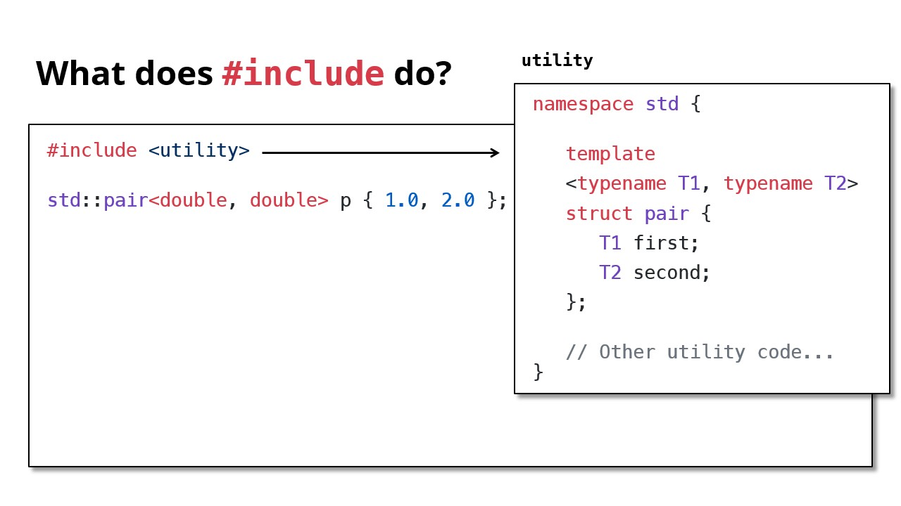
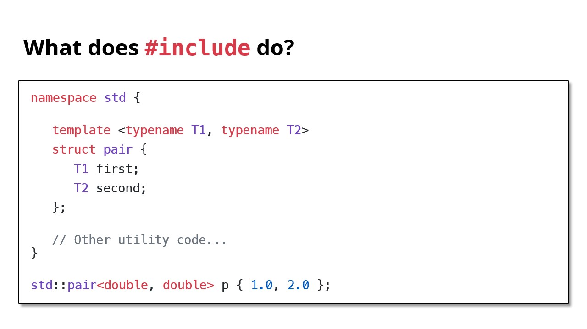

# Struct, 结构体

- type -> struct -> class
- Structs bundle data together into a single object
- A **struct** bundles **named variables** into a new type
- `std::pair` is a general purpose struct with two fields
- `#include` from the C++ Standard Library to use built-in types
	- And use the `std:: prefix` too!

## A fundamental problem

```cpp
____ issueNewID() {
	// How can we return all three things?
	// What should our return type be?

	// Python:
	// return "Jacob Roberts-Baca", "jtrb", 6504417
}
```

- Q: How do we return more than one value?
- A: Introducing ... structs!

## Structs bundle data together

```cpp
struct StanfordID {
	string name; // These are called fields
	string sunet; // Each has a name and type
	int idNumebr;
};

StanfordID id; // Initialize struct
id.name = "Jacob Roberts-Baca"; // Access field with '.'
id.sunet = "jtrb";
id.idNumber = 6504417;
```

## Returning multiple values

```cpp
StandfordID issueNewID() {
	StanfordID id;
	id.name = "Jacob Roberts-Baca";
	id.sunet = "jtrb";
	id.idNumber = 6504417;
	return id;
}
```

## List Initialization

```cpp
StanfordID id;
id.name = "Jacob Roberts-Baca";
id.sunet = "jtrb";
id.idNumber = 6504417;
```

```cpp
// Order depends on field order in struct. '=' is optional
StanfordID jrb = {"Jacob Roberts-Baca", "jtrb", 6504417};
StanfordID fi {"Fabio Ibanez", "fibanez", 6504418};
```

```cpp
StanfordID issueNewID() {
	StanfordID id = {"Jacob Roberts-Baca", "jtrb", 6502217};
	return id;
}

StanfordID issueNewID() {
	return {"Jacob Roberts-Baca", "jtrb", 6502217};
}
```

## Many Possible Structs



- We can use `std::pair`!

## `std::pair`

```cpp
struct Order {
	std::string item;
	int quantity;
};

Order dozen = {"Eggs", 12};
```

->

```cpp
std::pair<std::string, int> dozen {"Eggs", 12};
std::string item = dozen.first; // "Eggs"
int quantity = dozen.second; // 12
```

- `std::pair` is a template

```cpp
template <typename T1, typename T2>
struct pair {
	T1 first;
	T2 second;
};
std::pair<std::string, int>
```

```cpp
struct pair {
	std::string first;
	int second;
};
```

- To use `std::pair`, you must `#include` it
	- `std::pair` is defined in a header file called `utility`

```cpp
#include <utility>

// Now we can use `std::pair` in our code.

std::pair<double, double> point { 1.0, 2.0 };
```

- What does `#include` do?





---

Last Updated: Wed Oct 23 22:04:27 CST 2024


