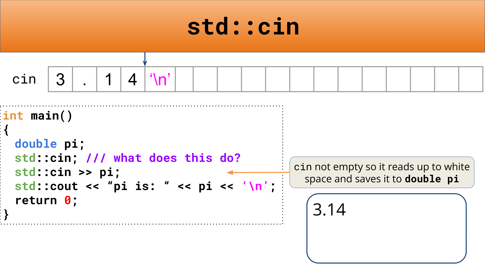

# Streams, 流
{: .no_toc }

## Table of Contents
{: .no_toc .text-delta }

1. TOC
{:toc}


- Streams are a general interface to read and write data in programs
- Input and output streams on the same source/destination type compliment each other!
- Don’t use `getline()` and `std::cin()` together, unless you *really really* have to!

## I/O 基本概念


## 输入输出操作


## 操纵符


### 操纵符（域宽）


### 操纵符（填充符）


### 操纵符（对齐方式）


### 操纵符（浮点数输出格式）


### 操纵符（浮点数精度）


### 操纵符等价用法


## Readings


> "Designing and implementing a general input/output facility for a programming language is notoriously difficult"
> 
> - Bjarne Stroustrup


- a general **input/output** facility for C++
- a general input/output **(IO) abstraction** for C++
	- **Abstractions:** Abstractions provide a consistent **interface**, and in the case of **streams** the interface is for **reading** and **writing** data!

- `cout` and `cin` known as the standard `iostreams`
- **`cerr` and `clog`** (more here: [GeeksForGeeks](https://www.geeksforgeeks.org/difference-between-cerr-and-clog/))
	- `cerr`: used to output errors (unbuffered)
	- `clog`: used for non-critical event logging (buffered)


- A familiar stream: `std::cout << "Hello, World << std::endl;`
	- `std::cout` - This is a stream
		- The `std::cout` stream is an **instance** of `std::ostream` which represents the standard output stream!


## An Input Stream


```cpp
void verifyPi()
{
	double pi;
	std::cin >> pi;
	/// verify the value of pi!
	std::cout << pi / 2 << '\n';
}
```


## Generalizing the Stream


- Why is this even useful?
	- Streams allow for a **universal** way of **dealing with external data**

## What streams actually are

- Classifying different types of streams

- **Input streams (I)**
	- a way to read data from a source
		- Are inherited from `std::istream`
		- ex. reading in something from the console (`std::cin`)
		- primary operator: `>>` (called the **extraction** operator)
- **Output streams (O)**
	- a way to write data to a destination
		- Are inherited from `std::ostream`
		- ex. writing out something to the console (`std::cout`)
		- primary operator: `<<` (called the **insertion** operator)


- This intersection is known as `iostream` which takes has all of the characteristics of `ostream` and `istream`!

## `std::stringstream`


- **What?:** a way to treat strings as streams
- **Utility?:** `stringstreams` are useful for use-cases that deal with mixing data types


### e.g.

```cpp
#include <iostream>
#include <vector>

int main()
{
    /// partial Bjarne Quote
    std::string initial_quote = "Bjarne Stroustrup C makes it easy to shoot yourself in the foot";
    
    /// create a stringstream
    std::stringstream ss(initial_quote); // initialize `stringstream` with string constructor
    
    /// data desinations
    std::string first;
    std::string last;
    std::string language, extracted_quote;
    
    ss >> first >> last >> language >> extracted_quote;
    std::cout << first << " " << last << " said this: " << language << " " << extracted_quote << std::endl;
    return 0;
}
```


## Use `getline()`!

```cpp
istream& getline(istream& is, string& str, char delim);
```

- `getline()` reads an input stream, `is`, up until the `delim` char and stores it in some buffer, `str`.
- The `delim` char is by default `\n`
- `getline()` **consumes** the `delim` character!
	- PAY ATTENTION TO THIS :)


## Output Streams


---

```cpp
cout << variable;
```

- a way to write data to a destination/external source
	- ex. writing out something to the console (`std::cout`)
	- use the `<<` operator to **send** to the output stream


### `std::endl`

- `endl`: Inserts an end-of-line sequence into the output stream and ensures that the characters in the output are written to the destination stream.

- `std::endl` tells the `cout` stream to end the line!


- `std::endl` **also** tells the stream to **flush**


### `\n`


- ✅ `std::cout << “Draaaakkkkeeeeeeeeee” << ‘\n’;`
- ❌ `std::cout << “Draaaakkkkeeeeeeeeee” << std::endl;`

---


### A shoutout and clarification


- <https://stackoverflow.com/questions/31162367/significance-of-ios-basesync-with-stdiofalse-cin-tienull>

## Output File Streams

- Output file streams have a type: `std::ofstream`
- a way to write data to a file!
	- use the `<<` **insertion** operator to **send** to the file
	- There are some methods for `std::ofstream` [check them out](https://cplusplus.com/reference/fstream/ofstream/)
	- Here are some you should know:
		- `is_open()`
		- `open()`
		- `close()`
		- `fail()`

### e.g.

```cpp
int main()
{
	/// associating file on construction
	std::ofstream ofs("hello.txt");
	if (ofs.is_open()) {
		ofs << "Hello CS106L!" << '\n';
	}
	ofs.close();
	ofs << "this will not get written";
	
	ofs.open("hello.txt");
	ofs << "this will though! It's open again";
	return 0;
}
```

- Creates an output file stream to the file “hello.txt”
- Checks if the file is open and if it is, then tries to write to it!
- This closes the output file stream to “hello.txt”
- Will silently fail
- Reopens the stream
- Successfully writes to stream

```cpp
int main()
{
	/// associating file on construction
	std::ofstream ofs("hello.txt");
	if (ofs.is_open()) {
		ofs << "Hello CS106L!" << '\n';
	}
	ofs.close();
	ofs << "this will not get written";
	
	ofs.open("hello.txt", std::ios::app);
	ofs << "this will though! It's open again";
	return 0;
}
```

- `std::ios::app` - Flag specifies you want to append, not truncate!

## Input File Streams

### e.g.

`append.txt`

```
first line;
second line;
```

```cpp
#include <fstream>
#include <iostream>

int inputFileStreamExample() {
	std::ifstream ifs("append.txt");
	if (ifs.is_open()) {
		std::string line;
		std::getline(ifs, line);
		std::cout << "Read from the file: " << line << '\n';
	}
	if (ifs.is_open()) {
		std::string lineTwo;
		std::getline(ifs, lineTwo);
		std::cout << "Read from the file: " << lineTwo << '\n';
	}
	return 0;
}

int main()
{
	inputFileStreamExample();
	return 0;
}
```

```
Read from the file: first line;
Read from the file: second line;
```

- Input and output streams on the same source/destination type are complimentary!


## Input Streams


```cpp
cin >> variable;
```

---

- Input streams have the type `std::istream`
- a way to read data from an destination/external source
	- use the `>>` *extractor* operator to **read** from the input stream
	- Remember the `std::cin` is the *console* input stream


- `std::cin` is buffered
- Think of it as a place where a user can store some data and then read from it
- `std::cin` buffer stops at a whitespace
- Whitespace in C++ includes:
	- “ ” – a literal space
	- `\n` character
	- `\t` character





### When `std::cin` fails!


### How do we fix this?

**Solution 1**


**Another solution**


**Conclusion**

- You shouldn’t use `getline()` and `std::cin()` together because of the difference in how they parse data.
- If you really do need to though, it *is* possible, but not recommended.

## Topic 3: `printf`

- [第2讲 printf语句与判断结构](https://www.acwing.com/file_system/file/content/whole/index/content/3587423/) from acwing.com

---


---

```cpp
#include <iostream>
#include <cstdio> // 使用`printf`时最好添加头文件 `#include <cstdio>`

using namespace std;

int main()
{
    printf("Hello World!");

    return 0;
}
```

| 类型       | 输出格式  |                    |
| -------- | ----- | ------------------ |
| `int`    | `%d`  |                    |
| `float`  | `%f`  | 默认保留 6 位小数         |
| `double` | `%lf` | 默认保留 6 位小数         |
| `char`   | `%c`  | 回车也是一个字符，用 `\n` 表示 |

```cpp
#include <iostream>
#include <cstdio>

using namespace std;

int main()
{
    int a = 3;
    float b = 3.12345678;
    double c = 3.12345678;
    char d = 'y';

    printf("%d\n", a);
    printf("%f\n", b);
    printf("%lf\n", c);
    printf("%c\n", d);

    return 0;
}
```

所有输出的变量均可包含在一个字符串中：

```cpp
#include <iostream>
#include <cstdio>

using namespace std;

int main()
{
    int a = 3;
    float b = 3.12345678;
    double c = 3.12345678;
    char d = 'y';

    printf("int a = %d, float b = %f\ndouble c = %lf, char d = %c\n", a, b, c, d);

    return 0;
}
```

{: .note-title }
> 练习
> 
> 输入一个字符，用这个字符输出一个菱形。

```cpp
#include <iostream>
#include <cstdio>

using namespace std;

int main()
{
    char c;
    cin >> c;

    printf("  %c\n", c);
    printf(" %c%c%c\n", c, c, c);
    printf("%c%c%c%c%c\n", c, c, c, c, c);
    printf(" %c%c%c\n", c, c, c);
    printf("  %c\n", c);

    return 0;
}
```

{: .note-title }
> 练习
> 
> 输入一个整数，表示时间，单位是秒。输出一个字符串，用”时:分:秒”的形式表示这个时间。

```cpp
#include <iostream>
#include <cstdio>

using namespace std;

int main()
{
    int t;

    cin >> t;

    int hours = t / 3600;
    int minutes = t % 3600 / 60;
    int seconds = t % 60;

    printf("%d:%d:%d\n", hours, minutes, seconds);

    return 0;
}
```

`float`, `double` 等输出保留若干位小数时用：`%.4f`, `%.3lf`

```cpp
#include <iostream>
#include <cstdio>

using namespace std;

int main()
{
    float b = 3.12345678;
    double c = 3.12345678;

    printf("%.4f\n", b);
    printf("%.3lf\n", c);

    return 0;
}
```

**最小数字宽度**

`%8.3f`, 表示这个浮点数的最小宽度为 8，保留 3 位小数，当宽度不足时在前面补空格。

```cpp
#include <iostream>
#include <cstdio>

using namespace std;

int main()
{
    int a = 3;
    float b = 3.12345678;
    double c = 3.12345678;

    printf("%5d\n", a);
    printf("%8.4f\n", b);
    printf("%7.3lf\n", c);

    return 0;
}
```

`%-8.3f`，表示最小宽度为 8，保留 3 位小数，当宽度不足时在后面补上空格。

```cpp
#include <iostream>
#include <cstdio>

using namespace std;

int main()
{
    int a = 3;
    float b = 3.12345678;
    double c = 3.12345678;

    printf("%-5d!\n", a);
    printf("%-8.4f!\n", b);
    printf("%-7.3lf!\n", c);

    return 0;
}
```


`%08.3f` , 表示最小宽度为 8，保留 3 位小数，当宽度不足时在前面补上 0。

```cpp
#include <iostream>
#include <cstdio>

using namespace std;

int main()
{
    int a = 3;
    float b = 3.12345678;
    double c = 3.12345678;

    printf("%05d\n", a);
    printf("%08.4f\n", b);
    printf("%07.3lf\n", c);

    return 0;
}
```

## C 语言文件读写


---

```cpp
#include <iostream>
#include <fstream>
using namespace std;

int main()
{
	ofstream ofs;
	ofs.open("info.txt");

	ofs << "姓名：张三\n";
	ofs << "性别：男\n";
	ofs << "年龄：18\n";

	ofs.close();
	
	return 0;
}
```

```cpp
#include <iostream>
#include <fstream>
using namespace std;

int main()
{
	int a;
	ifstream ifs;
	ifs.open("info.txt");
	if (!ifs) {
		cout << "Error\n";
		exit(1);
	}
	while (ifs >> a) {
		cout << a << ' ';
	}

	return 0;
}
```

```cpp
#include <iostream>
#include <fstream>
using namespace std;

int main()
{
	int a, b, c;
	ifstream ifs("input.txt");
	ofstream ofs("output.txt");
	for (int i = 1; i <= 5; i++) {
		ifs >> a >> b;
		c = a * b;
		ofs << c << '\n';
	}
	ifs.close();
	ofs.close();

	return 0;
}
```

```cpp
#include <iostream>
#include <fstream>
using namespace std;

int main()
{
	int a[10];
	ifstream ifs("input.txt");
	ofstream ofs("output.txt");
	
	ifs.close();
	ofs.close();

	return 0;
}
```

```cpp
fstream ifs, ofs;
ifs.open("input.txt", ios::in);
ofs.open("output.txt", ios::out);

ifs >> a;
ofs << a;
```

```cpp
ios::in
ios::out
ios::ate
ios::app
ios::binary

ios::binary | ios::out
```

`app` comes from 'append' - all output will be added (appended) to the end of the file. In other words you cannot write anywhere else in the file but at the end.

`ate` comes from 'at end' - it sets the stream position at the end of the file when you open it, but you are free to move it around (seek) and write wherever it pleases you.

---

## 打开二进制文件

```cpp
ostream& write(const char* buffer, int len);
```

```cpp
class Person
{
public:
	char m_Name[64];
	int m_age;
};

int main()
{
	ofstream ofs("person.txt", ios::out | ios::binary);
	Person p = {"张三", 18};
	ofs.write((char*)&p, sizeof(p));
	ofs.close();
	return 0;
}
```

## 移动文件指针

```cpp
ifs.seekg(int, ios::_dir)
// int: moved bytes
// ios::_dir: relative position
//   beg
//   cur
//   end
```

---

Last Updated: Sat Oct  5 13:17:03 CST 2024


