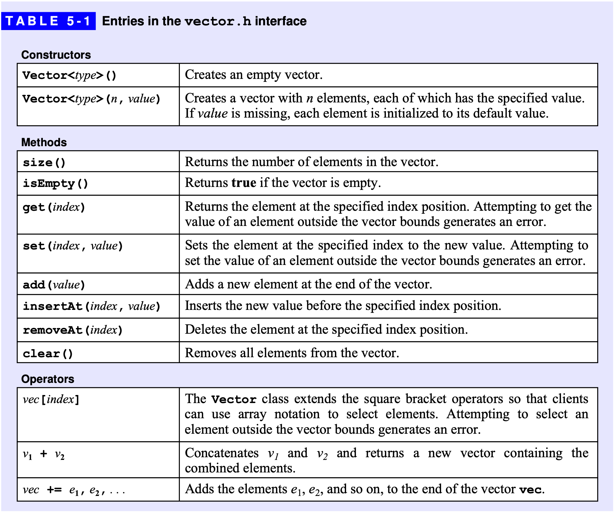
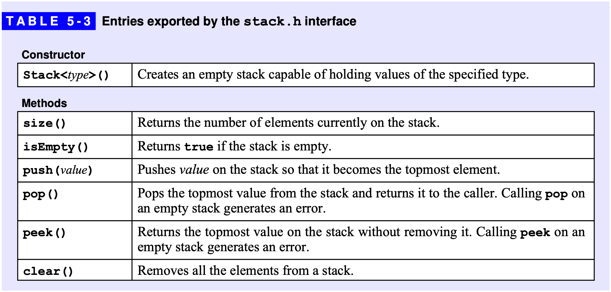
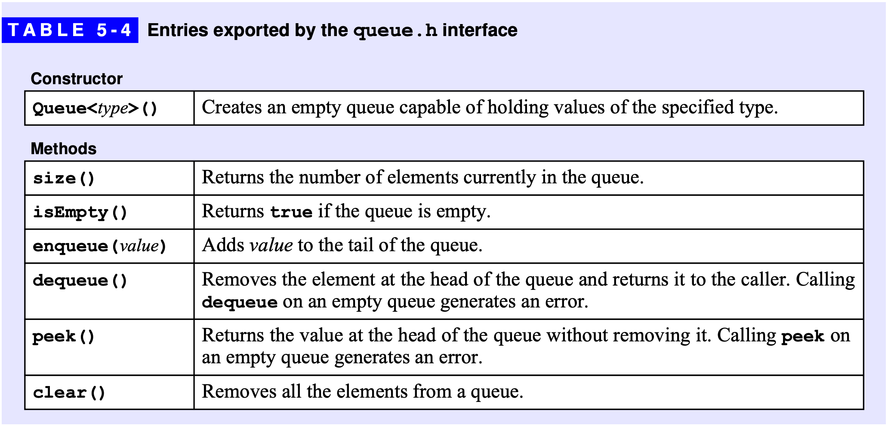
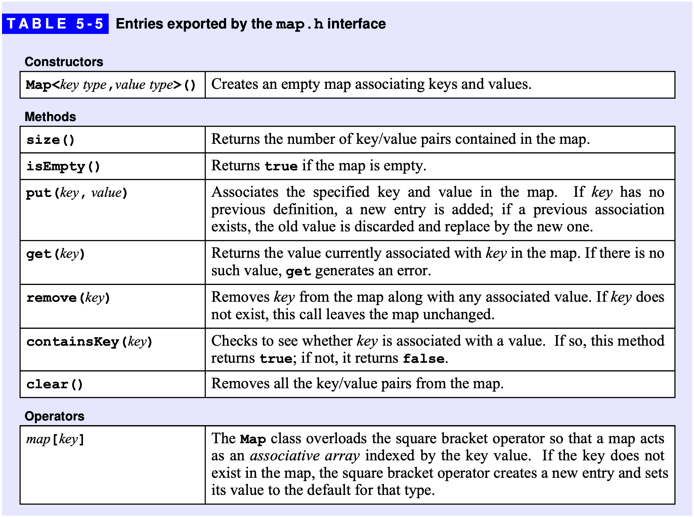
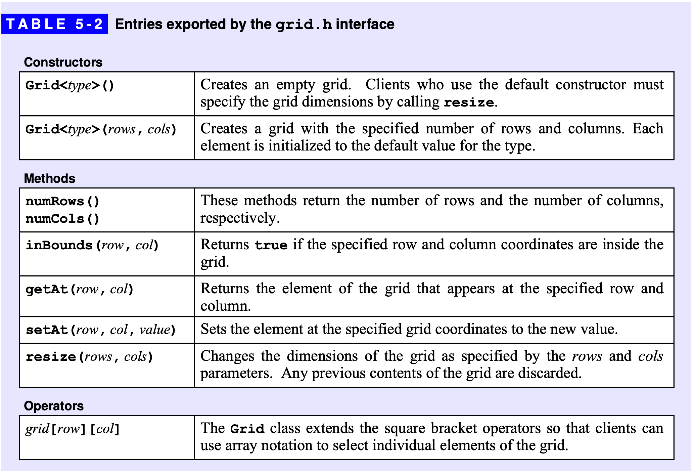

---
aliases:
  - STL
  - Standard Template Library
title: STL
layout: home
parent: Notes
---

# STL (Standard Template Library)
{: .no_toc }

## Table of Contents
{: .no_toc .text-delta }

1. TOC
{:toc}

---

- Q: WHY STL?
- A: 为了提高编程效率。

## STL

The STL is a C++ library that provides a set of easily **composable C++ container classes** (container, collection) and **generic algorithms (template functions)**.

- The container classes include:
	- Sequence Containers (objects that store collections of other objects strictly
	- in a linear arrangement):
		- vector - indexable sequence of items (like an array)
		- list   - singly and doubly linked
		- stack  - always insert (called push) and remove (called pop) at the same end
		- queue  - always insert at one end (the rear), remove from the other end 
		- deque  - double-ended queue, insert/remove at either end
	- Associative Containers (non-linear - supports efficient retrieval; supports
	- insertion and removal of elements, but differs from a Sequence in that it
	- does not provide insertion of an element at a specific position):
		- set - unique key (item is in once)
		- multiset - allows duplicate keys/items
		- priority queue
		- map - mapping of unique key/value pairs (given a key, it produces a value)
		- multimap - duplicate copies of the same key 

Iterators for the containers include forward, bidirectional, random access.
They include (although not all have all) the common operations of <, >, etc.

The generic algorithms include many common tasks, e.g., searching, sorting,
merging, copying, etc.

from <https://courses.washington.edu/css342/zander/Notes/template>

## Iterators, 迭代器

- Definition: Iterators are a software design pattern that abstracts the process of traversing through a collection of items.
- Note: `vector[i]` or `array[i]` can be considered as a primitive iterator
- An iterator should include 
	- Current position
	- Retrieval of the current item
	- Stepping to the next position (forward or backward)

from <https://courses.washington.edu/css342/zander/Notes/template>

- Iterator categories
	- Forward: for one-directional traversal of a sequence, expressed with `++`
	- Bidirectional: traversal in both directions, expressed with `++` and `--`
	- Random access: for bidirectional traversal
		- long jumps: `r += n` and `r -= n`
		- addition and substraction: `r + n` and `r - n`
		- iterator subtraction: `r - s` where `s`  is another random access iterator
		- comparisons: `r<s`, `r>s`, `r<=s`, `r>=s` 
		- equality: `==` and `!=`
		- dereferencing: use `*`

from <https://courses.washington.edu/css342/zander/Notes/stl>

## `<vector>`

- vector, 变长数组
- 支持随机访问，不支持在任意位置 O(1) 插入
- 为了保证效率，元素的增删一般应该在末尾进行



- `size()`, `isEmpty()`: O(1)
- `front()`: 返回 `vector` 的第一个元素
	- `vec.begin()`
	- `vec[0]`
- `back()` : 返回 `vector` 的最后一个元素
	- `*--a.end()`
	- `a[a.size() – 1]`
- `push_back(x)`
- `pop_back()`

**声明**

```cpp
#include <vector>   // 头文件
vector<int> a;      // 相当于一个长度动态变化的int数组
vector<int> b[233]; // 相当于第一维长233，第二位长度动态变化的int数组
struct rec{…};
vector<rec> c;      // 自定义的结构体类型也可以保存在vector中
```

**迭代器**

迭代器就像 STL 容器的“指针”，可以用星号 `*` 操作符解除引用。

一个保存 `int` 的vector的迭代器声明方法为：

```cpp
vector<int>::iterator it;
```

`vector` 的迭代器是“随机访问迭代器”，可以把 `vector` 的迭代器与一个整数相加减，其行为和指针的移动类似。可以把 `vector` 的两个迭代器相减，其结果也和指针相减类似，得到两个迭代器对应下标之间的距离。

**`begin()`, `end()`**

`begin` 函数返回指向 `vector` 中第一个元素的迭代器。例如 `a` 是一个非空的 `vector`，则 `*a.begin()` 与 `a[0]` 的作用相同。

所有的容器都可以视作一个“前闭后开”的结构，`end()` 返回 `vector` 的尾部，即第 `n` 个元素再往后的“边界”。`*a.end()` 与 `a[n]` 都是越界访问，其中 `n = a.size()`。

下面两份代码都遍历了 `vector<int> a`，并输出它的所有元素。

```cpp
for (int i = 0; i < a.size(); i ++)
    cout << a[i] << endl;

for (vector<int>::iterator it = a.begin(); it != a.end(); it ++)
    cout << *it << endl;
```

## `<stack>`



## `<queue>`



1. 循环队列 `queue` 
2. 优先队列 `priority_queue` 

**声明**

```cpp
queue<int> q;
struct rec{…}; queue<rec> q;                        // 结构体rec中必须定义小于号
priority_queue<int> q;                              // 大根堆
priority_queue<int, vector<int>, greater<int>> q;   // 小根堆
priority_queue<pair<int, int>>q;
```

循环队列 `queue`

```cpp
push    // 从队尾插入
pop     // 从队头弹出
front   // 返回队头元素
back    // 返回队尾元素
```

优先队列 `priority_queue`

```cpp
push    // 把元素插入堆
pop     // 删除堆顶元素
top     // 查询堆顶元素（最大值）
```

## `<deque>`

双端队列 `deque` 是一个支持在两端高效插入或删除元素的连续线性存储空间。它就像是 `vector` 和`queue` 的结合。与vector相比，deque在头部增删元素仅需要 O(1) 的时间；与 `queue` 相比，`deque` 像数组一样支持随机访问。

```cpp
[]              // 随机访问
begin/end       // 返回deque的头/尾迭代器
front/back      // 队头/队尾元素
push_back       // 从队尾入队
push_front      // 从队头入队
pop_back        // 从队尾出队
pop_front       // 从队头出队
clear           // 清空队列
```

## `<set>`

头文件 `set` 主要包括 `set` 和 `multiset` 两个容器，分别是“有序集合”和“有序多重集合”，即前者的元素不能重复，而后者可以包含若干个相等的元素。`set` 和 `multiset` 的内部实现是一棵红黑树，它们支持的函数基本相同。

**声明**

```cpp
set<int> s;
struct rec{…}; set<rec> s;  // 结构体rec中必须定义小于号
multiset<double> s;
```

**size/empty/clear**

与vector类似

**迭代器**

`set` 和 `multiset` 的迭代器称为“双向访问迭代器”，不支持“随机访问”，支持星号`*`解除引用，仅支持`++` 和 `--` 两个与算术相关的操作。

设it是一个迭代器，例如 `set<int>::iterator it;`

若把 `it ++`，则 `it` 会指向“下一个”元素。这里的“下一个”元素是指在元素从小到大排序的结果中，排在 `it` 下一名的元素。同理，若把 `it --` ，则 `it `将会指向排在“上一个”的元素。

**begin/end**

返回集合的首、尾迭代器，时间复杂度均为 O(1)。

`s.begin()` 是指向集合中最小元素的迭代器。

`s.end()` 是指向集合中最大元素的下一个位置的迭代器。换言之，就像 `vector` 一样，是一个“前闭后开”的形式。因此 `-- s.end()` 是指向集合中最大元素的迭代器。

**insert**
`s.insert(x)` 把一个元素 `x` 插入到集合 `s` 中，时间复杂度为 `O(logn)` 。

在 `set` 中，若元素已存在，则不会重复插入该元素，对集合的状态无影响。

**find**

`s.find(x)` 在集合 `s` 中查找等于 `x` 的元素，并返回指向该元素的迭代器。若不存在，则返回 `s.end()` 。时间复杂度为 O(logn)。

5.7 `lower_bound/upper_bound`
这两个函数的用法与 `find` 类似，但查找的条件略有不同，时间复杂度为 O(logn)。

`s.lower_bound(x)` 查找大于等于 `x` 的元素中最小的一个，并返回指向该元素的迭代器。

`s.upper_bound(x)` 查找大于 `x` 的元素中最小的一个，并返回指向该元素的迭代器。

**erase**

设 `it` 是一个迭代器，`s.erase(it)` 从 `s` 中删除迭代器it指向的元素，时间复杂度为 O(logn)。

设 `x` 是一个元素，`s.erase(x)` 从 `s` 中删除所有等于 `x` 的元素，时间复杂度为 O(k+logn)，其中 `k`  是被删除的元素个数。

**count**

`s.count(x)` 返回集合 `s` 中等于x的元素个数，时间复杂度为 O(k+logn)，其中 `k` 为元素x的个数。

## `<map>`



map容器是一个键值对key-value的映射，其内部实现是一棵以key为关键码的红黑树。Map的key和value可以是任意类型，其中key必须定义小于号运算符。

6.1 声明

```cpp
map<key_type, value_type> name;

//例如：
map<long long, bool> vis;
map<string, int> hash;
map<pair<int, int>, vector<int>> test;
```


6.2 size/empty/clear/begin/end
均与set类似。

6.3 insert/erase
与set类似，但其参数均是pair<key_type, value_type>。

6.4 find
h.find(x)在变量名为h的map中查找key为x的二元组。

6.5 []操作符
h[key]返回key映射的value的引用，时间复杂度为 O(logn)
𝑂
(
𝑙
𝑜
𝑔
𝑛
)
。

[]操作符是map最吸引人的地方。我们可以很方便地通过h[key]来得到key对应的value，还可以对h[key]进行赋值操作，改变key对应的value。

## `<grid>`



## Readings

- <https://web.stanford.edu/class/archive/cs/cs106b/cs106b.1238/lectures/04-vector-grid/>
	- <https://web.stanford.edu/class/archive/cs/cs106b/cs106b.1238/lectures/04-vector-grid/6_29_Lecture_4.pdf>
	- <https://web.stanford.edu/dept/cs_edu/resources/cslib_docs/Vector.html>
- <https://www.acwing.com/file_system/file/content/whole/index/content/3598249/>

---

Last Updated: Fri Oct  4 11:21:43 CST 2024
