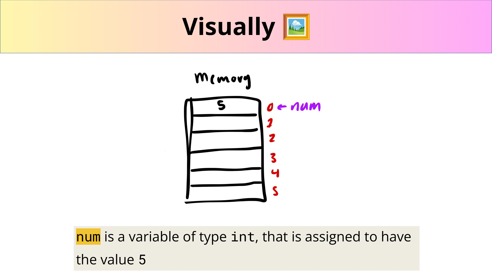
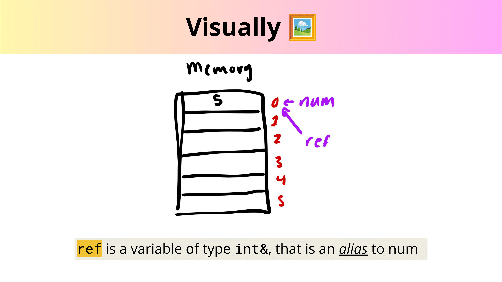
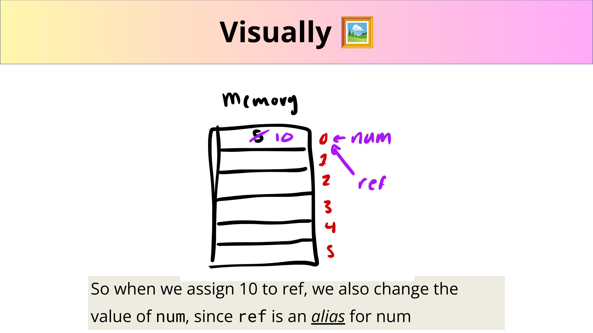
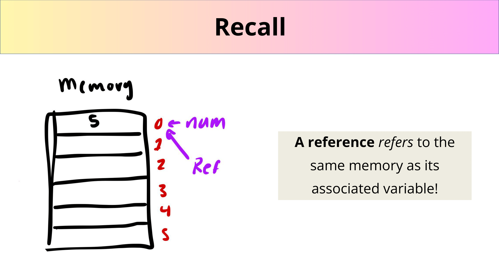
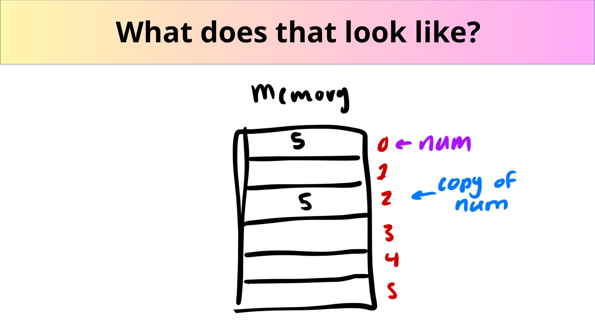
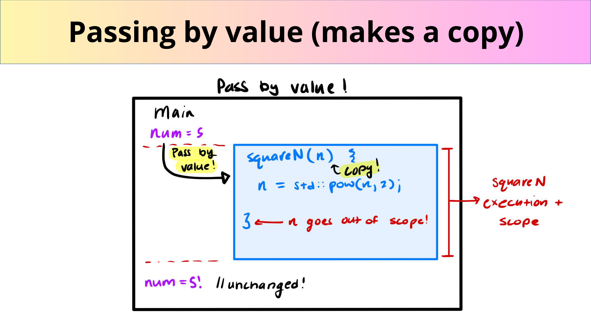
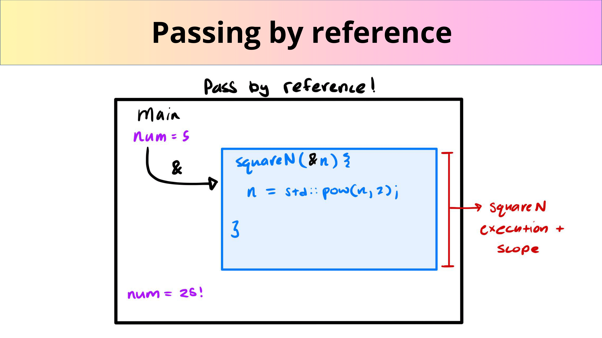
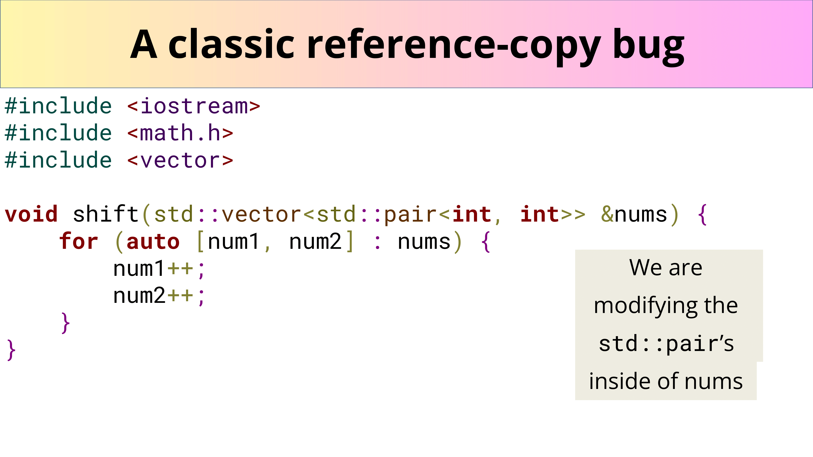
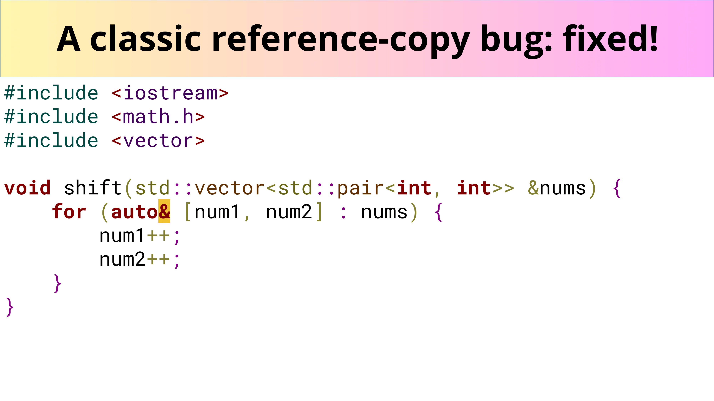

# References, 引用

- **References are a way to alias variables!**
- **You can only reference an l-value!**
- **A way of giving variables *aliases* and having multiple variables all refer the the *same memory*.**

---

- **What?:** “Declares a name variable as a reference”
	- tldr: a reference is an alias to an already-existing thing - [cppreference.com](https://en.cppreference.com/w/cpp/language/reference)
- **How? 🤔:** Use an ampersand (&)

```cpp
int num = 5;
int& ref = num;

ref = 10; // Assigning a new value through the reference
std::cout << num << std::endl; // Output: 10
```

- `num` is a variable of type `int`, that is assigned to have the value 5
- `ref` is a variable of type `int&`, that is an **alias** to `num`
- So when we assign 10 to `ref`, we also change the value of `num`, since `ref` is an **alias** for `num`







## Pass by reference

- In 106B we learn about “pass by reference”. We can apply the same ideas from referenced variables to functions! Take a look:

```cpp
#include <iostream>
#include <math.h>

// note the ampersand!
void squareN(int& n) {
    // calculates n to the power of 2
    n = std::pow(n, 2);
}

int main() {
    int num = 2;
    squareN(num);
    std::cout << num << std::endl;
    
    return 0;
}
```

- **Notice!!:** `n` is being passed into `squareN` by reference, denoted by the ampersand!
- **So what❓:** This means that `n` is actually going to be modified inside of `squareN`.



## Passing by value

- Passing in a variable by **reference** into a function just means “**Hey take in the actual piece of memory, don’t make a copy!**”
- Passing in a variable by **value** into a function just means “**Hey make a copy, don’t take in the actual variable!**”







## An edge case: a classic reference-copy bug

```cpp
#include <iostream>
#include <math.h>
#include <vector>

void shift(std::vector<std::pair<int, int>> &nums) {
    for (auto [num1, num2] : nums) {
        num1++;
        num2++;
    }
}
```

- 🤔 But `nums` is passed in by reference…
- Note the *structured binding*!
	- `auto [num1, num2] : nums`
- We’re not modifying `nums` in this function!
- We're modifying the `std::pair`'s inside of `nums`





---

Last Updated: Fri Oct 25 09:27:32 CST 2024