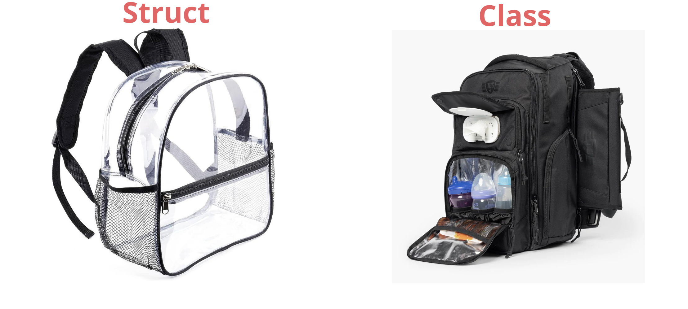
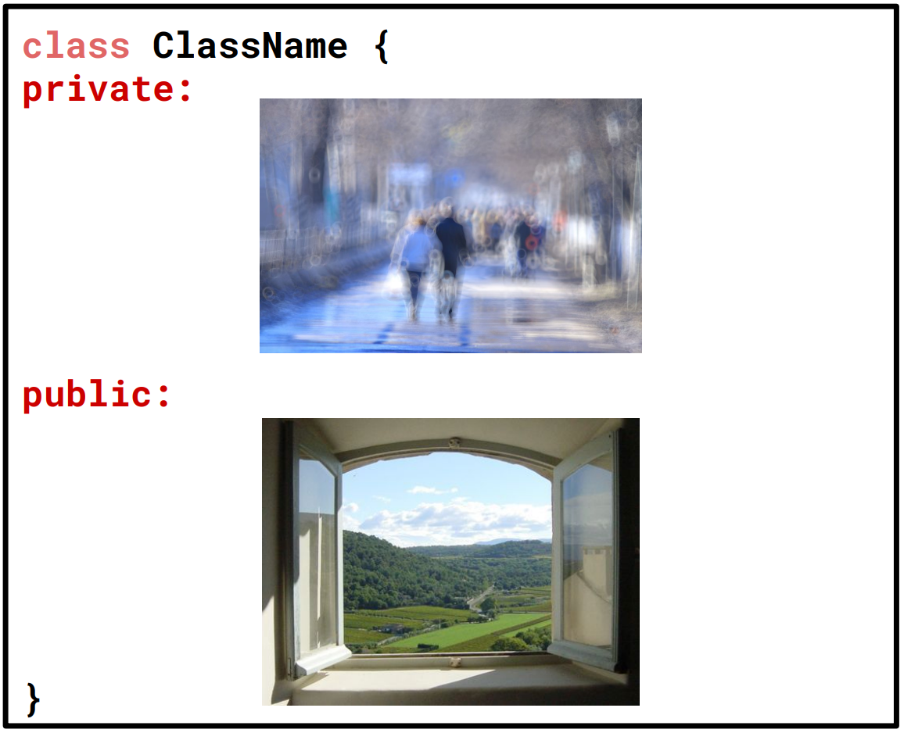

# Classes, 类
{: .no_toc }

## Table of Contents
{: .no_toc .text-delta }

1. TOC
{:toc}

## Readings

- [x] Slide: <https://web.stanford.edu/class/cs106l/lectures/F2407_Classes.pdf>

- https://icarus.cs.weber.edu/~dab/
- https://icarus.cs.weber.edu/~dab/cs1410/textbook/9.Classes_And_Objects/classes_and_objects.html
- http://www.math.uaa.alaska.edu/~afkjm/csce211/handouts/SeparateCompilation.pdf
- https://www.bu.edu/tech/files/2020/02/Introduction-to-C-Part-3.pdf
- https://www2.cs.arizona.edu/~mercer/compfun3/presentations/06_Classes.pdf
- https://ee.usc.edu/~redekopp/cs103/slides/Unit10_Classes.pdf
- https://pages.cs.wisc.edu/~hasti/cs368/CppTutorial/NOTES/CLASSES-INTRO.html

---

- Classes allow you to encapsulate functionality and data with access protections

## Comparing `struct` and `class`




> structures which are classes **without access restrictions**;


## `struct`s

```cpp
struct StudentID {
	std::string name; // these are fields!
	std::string sunet;
	int idNumber;
};

Student s;
s.name = "Fabio Ibanez";
s.sunet = "fabioi";
// s.idNumber = 01243425;
s.idNumber = -123451234512345; // ?
```

- All these fields are **public**, i.e. can be changed by the user
- There are no **direct access controls** while using structs

## `class`es



```cpp
class ClassName {
private:

public:

};
```

- Classes have **public** and **private** sections!
- A user can access the **public** stuff
- But is **restricted** from accessing the private stuff

## a StanfordID class

```cpp
struct StanfordID {
	string name;        // These are called fields
	string sunet;       // Each has a name and type
	int idNumber;
};

StanfordID id;          // Access fields with `.`
id.name = "Jacob Roberts-Baca";
id.sunet = "jtrb";
id.idNumber = 6504417;
```

## Header File (.h) vs Source Files (.cpp)

|          | Header File (.h)                                                             | Source File (.cpp)                        |
| -------- | ---------------------------------------------------------------------------- | ----------------------------------------- |
| Purpose  | Defines the interface                                                        | Implements class functions                |
| Contains | Function prototypes, class declarations, type definitions, macros, constants | Function implementations, executable code |
| Access   | This is shared across source files                                           | Is compiled into an object file           |
| Example  | `void someFunction();`                                                       | `void someFunction() {...};`              |

## Class design

1. A constructor
2. Private member functions/variables
3. Public member functions (interface for a user)
4. Destructor

### Constructor

- The constructor initializes the state of newly created objects
- For our **StudentID** class what do our objects need?
	- `s.name = “Fabio Ibanez”;`
	- `s.sunet = “fabioi”;`
	- `s.idNumber = 01243425;`

**.h file**

```cpp
class StudentID {
private:
	std::string name;
	std::string sunet;
	int idNumber;
public:
	// constructor for our student
	StudentID(std::string name, std::string sunet, int idNumber);
	// method to get name, sunet, and idNumber, respectively
	std::string getName();
	std::string getSunet();
	int getID();
}
```

- The syntax for the constructor is just the name of the class

### Parameterized Constructor

**.cpp file (implementation)**

```cpp
#include "StudentID.h"
#include <string>

StudentID::StudentID(std::string name, std::string sunet, int idNumber) {
	name = name;
	sunet = sunet;
	// We can now also enforce checks on the values that we initialize or modify our members to!
	if ( idNumber > 0 ) idNumber = idNumber;
}
```

- Remember namespaces, like `std::`
- In our **.cpp** file we need to use our class as our namespace when defining our member functions

### Use the this keyword

```cpp
#include "StudentID.h"
#include <string>

StudentID::StudentID(std::string name, std::string sunet, int idNumber) {
	this->name = name;
	this->state = state;
	this->age = age;
}
```

- Use this **`this`** keyword to **disambiguate** which `name` you’re referring to.

### List initialization constructor (C++11)

```cpp
#include "StudentID.h"
#include <string>

// list initialization constructor
StudentID::StudentID(std::string name, std::string sunet, int idNumber): name{name}, sunet{sunet}, idNumber{idNumber} {};
```

- Recall, uniform initialization, this is similar but not quite!

### Default constructor

```cpp
#include "StudentID.h"
#include <string>

// default constructor
StudentID::StudentID() {
	name = “John Appleseed”;
	sunet = “jappleseed”;
	idNumber = 00000001;
}
```

- If we call our constructor without parameters we can set default ones!

### Constructor Overload

```cpp
#include "StudentID.h"
#include <string>

// default constructor
StudentID::StudentID() {
	name = “John Appleseed”;
	sunet = “jappleseed”;
	idNumber = 00000001;
}

// parameterized constructor
StudentID::StudentID(std::string name, std::string sunet, int idNumber) {
	this->name = name;
	this->state = state;
	this->age = age;
}
```

- Our compilers will know which one we want to use based on the inputs!

### Implemented members

```cpp
#include "StudentID.h"
#include <string>

std::string StudentID::getName() {

}

std::string StudentID::getSunet() {

}

int StudentID::getID() {

}
```

```cpp
#include "StudentID.h"
#include <string>

std::string StudentID::getName() {
	return this->name;
}

std::string StudentID::getSunet() {
	return this->sunet;
}

int StudentID::getID() {
	return this->idNumber;
}
```

### Implemented members (setter functions)

```cpp
#include "StudentID.h"
#include <string>

void StudentID::setName(std::string name) {
	this->name = name;
}

void StudentID::setSunset(std::string sunet) {
	this->sunet = sunet;
}

void StudentID::setID(int idNumber) {
	if (idNumber >= 0) {
		this->idNumber = idNumber;
	}
}
```

### The destructor

```cpp
#include "StudentID.h"
#include <string>

StudentID::~StudentID() {
	// free/deallocate any data here
	delete [] my_array; /// for illustration
}
```

- In our **StudentID** class we are not dynamically allocating any data by using the **`new`** keyword
- Nonetheless destructors are an important part of an object’s lifecycle.
- The destructor is not explicitly called, it is automatically called when an object goes out of scope

### Type aliasing

- **Type aliasing** - allows you to create synonymous identifiers for types

```cpp
template <typename T>
class vector {
	using iterator = T*;

	// Implementation details...
};
```

## Other stuff (TODO)

```cpp
/*
 * Class: Point
 * ------------
 * This class represents an x-y coordinate point on a two-dimensional
 * integer grid.
 */

using namespace std;

class Point {

public:
	// Constructors
	Point() {
		x = 0;
		y = 0;
	}
	Point(int xc, int yc) {
		x = xc;
		y = yc;
	}
	// Getter methods
	int getX() {
		return x;
	}
	int getY() {
		return y;
	}
	string toString() {
		return "(" + x + "," + y + ")";
	}

private:
	// Instance variables
	int x;
	int y;

}
```

```cpp
#include <iostream>
#include <string>

using namespace std;

// Definition of the Student class
class Student {

public:
    // Public method to simulate the student studying
    // This method prints a message indicating that the student is studying C++
    void study() {
        cout << "Learning C++" << endl;
    }
    
    // Public method to simulate the student taking an exam
    // This method prints a message indicating the student achieved 100 points in a C++ exam
    void exam() {
        cout << "C++ exam score: 100 points" << endl;
    }

private:
    // Private member variable to store the student's name
    string _name;
    
    // Private member variable to store the student's age
    int _age;

};
```

```cpp
#include <iostream>
#include <string>

using namespace std;

// Definition of the Student class
// This class represents a student with basic functionalities
// such as studying and taking exams. It also contains private
// attributes for the student's name and age.
class Student {

public:
    // Declaration of the study method
    // This method will print a message indicating the student is studying C++
    void study();

    // Declaration of the exam method
    // This method will print a message indicating the student has achieved a score of 100 in the C++ exam
    void exam();

private:
    // Private member variable to store the student's name
    // This variable is not directly accessible from outside the class
    string _name;
    
    // Private member variable to store the student's age
    // This variable is also private, ensuring encapsulation
    int _age;

};

// Definition of the study method outside the class
// This method prints a message indicating that the student is studying C++
void Student::study() {
    cout << "Learning C++" << endl;
}

// Definition of the exam method outside the class
// This method prints a message indicating the student received a score of 100 in the C++ exam
void Student::exam() {
    cout << "C++ exam score: 100 points" << endl;
}
```

## Lec 07 Notes (TODO)

## 1 类的访问控制

### 引用私有成员的 5 种方式

1. 调用共有函数为私有对象赋值
2. 利用指针访问私有数据成员
3. 利用函数返回私有数据成员值
4. 利用引用访问私有数据成员
5. 返回私有数据成员的引用，为私有数据成员赋值
	- 返回一个引用，用返回的引用作为左值，引用本质上就是一个被锁定的指针
	- `int* const 无名指针 = &x`

## 2 成员函数的重载

- 重载：名一样，参数不一样
- 函数重载的好处：不改动原来函数

## 3 类指针

- 类，结构体，是很相似的
- `->` 指针来使用成员变量

## 4 构造函数，析构函数

- 构造：初始化
- 析构：删除时处理后事

- 生成对象的时候，系统默认调用
- 析构函数，负责善后
- 构造函数没有返回值，系统处理
- 析构函数名与类名相同，但在其前面会加上字符 `~`，无返无参
	- 限制条件越多，越简单
	- 就是这样，变不了了

- 构造函数的分类
	- 无参构造
	- 有参构造
		- 括号法（常用） `Person p1(10);`
		- **显式法（本质）**  `person p2 = Person(10);`
		- 隐式转换法（特殊写法，等号）`Person p4 = 10;`
	- 拷贝构造函数
		- 用一个对象给另一个对象初始化
		- 引用才是拷贝函数，而不是指针
		- 构造函数的参数是另一个对象的**引用**，用引用传过去
		- 主要用来为另一个对象初始化

#### 拷贝构造函数调用时机

```cpp
Person newman3;
newman3 = man;
```

#### 构造函数调用规则

- 每个对象必须有相应的构造函数，如果没有，系统会提供默认的构造函数
	- 默认构造函数
	- 默认析构函数
	- 默认拷贝构造函数

#### 重载、默认参数

#### 初始化列表

- 函数定义中不要出现默认参数，默认参数写在函数声明里
- 带默认参数的构造函数，默认参数写在函数声明里

#### 局部对象、静态对象、全局对象初始化顺序


---

Last Updated: Wed Oct 16 16:53:37 CST 2024
