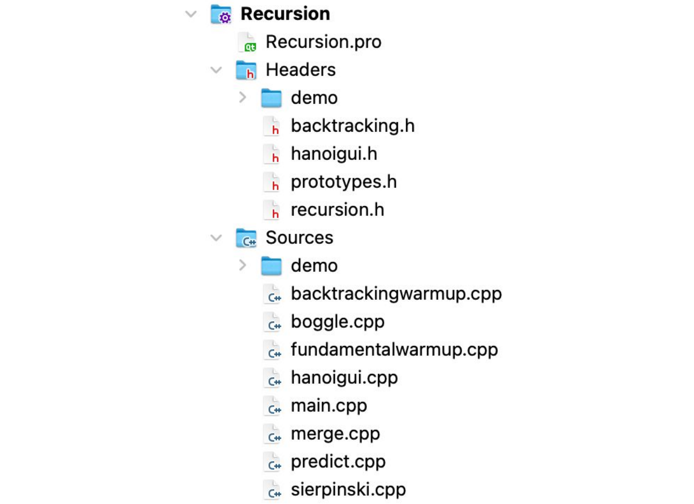
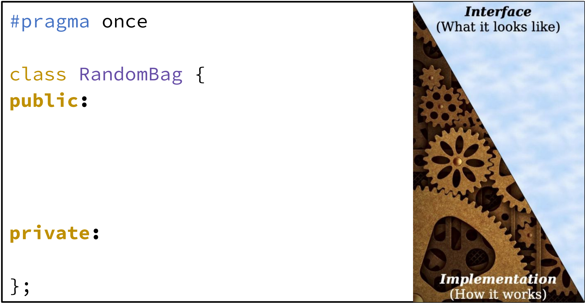
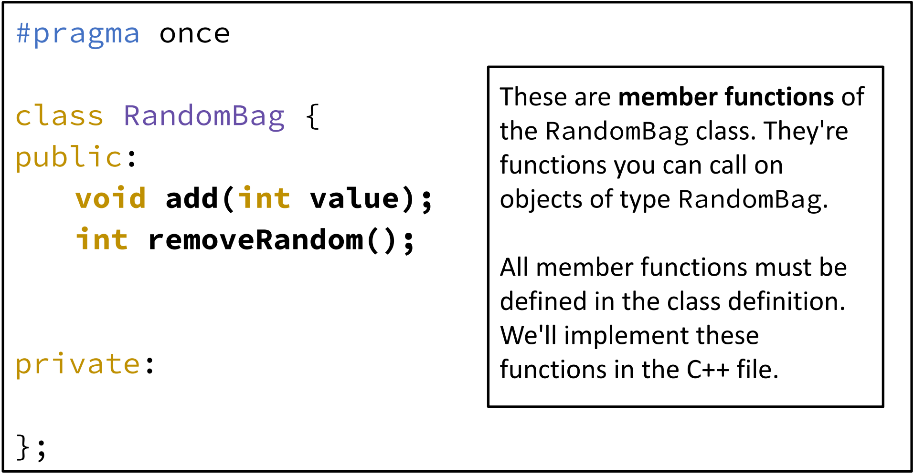

# Classes, 类
{: .no_toc }

## Table of Contents
{: .no_toc .text-delta }

1. TOC
{:toc}

## Readings

- [x] Slide: <https://web.stanford.edu/class/cs106l/lectures/F2407_Classes.pdf>
- [x] Slide: https://web.stanford.edu/class/archive/cs/cs106b/cs106b.1238/lectures/14-classes/7_20_Lecture_14.pdf

- https://icarus.cs.weber.edu/~dab/
- https://icarus.cs.weber.edu/~dab/cs1410/textbook/9.Classes_And_Objects/classes_and_objects.html
- http://www.math.uaa.alaska.edu/~afkjm/csce211/handouts/SeparateCompilation.pdf
- https://www.bu.edu/tech/files/2020/02/Introduction-to-C-Part-3.pdf
- https://www2.cs.arizona.edu/~mercer/compfun3/presentations/06_Classes.pdf
- https://ee.usc.edu/~redekopp/cs103/slides/Unit10_Classes.pdf
- https://pages.cs.wisc.edu/~hasti/cs368/CppTutorial/NOTES/CLASSES-INTRO.html

---

- Classes allow you to encapsulate functionality and data with access protections

## Structs vs. Classes


> structures which are classes **without access restrictions**;


## `struct`s

```cpp
struct StudentID {
	std::string name; // these are fields!
	std::string sunet;
	int idNumber;
};

Student s;
s.name = "Fabio Ibanez";
s.sunet = "fabioi";
// s.idNumber = 01243425;
s.idNumber = -123451234512345; // ?
```

- CS106L
	- All these fields are **public**, i.e. can be changed by the user
	- There are no **direct access controls** while using structs
- CS106B
	- Way to bundle different types of information
		- Package data into one place
	- Like **creating a custom data structure** or variable

## `class`


```cpp
class ClassName {
private:

public:

};
```

- CS106L
	- Classes have **public** and **private** sections!
	- A user can access the **public** stuff
	- But is **restricted** from accessing the private stuff
	- A class bundles data and methods for an object together
- CS106B
	- Defines a new data type for our program to use
	- Help us create types of objects
		- Which is why we call this object-oriented programming!
	- The only difference between structs and classes are the encapsulation defaults
		- Struct defaults to **public** members (accessible outside the struct itself).
		- Class defaults to **private** members (accessible only inside the class implementation).
	- Every class has two parts:
		- an **interface** specifying what operations can be performed on instances of the class
		- an **implementation** specifying how those operations are to be performed
	- Another way to think about classes…
		- A **blueprint** for a new type of C++ **object**!
		- The blueprint describes a general structure, and we can create specific **instances** of our class using this structure.
	- **instance**
		- When we create an object that is our new type, we call this creating an instance of our class.
		- `Vector vec;`
			- Creates an **instance** of the Vector **class** (i.e. an object of the type `Vector`)


## a StanfordID class

```cpp
struct StanfordID {
	string name;        // These are called fields
	string sunet;       // Each has a name and type
	int idNumber;
};

StanfordID id;          // Access fields with `.`
id.name = "Jacob Roberts-Baca";
id.sunet = "jtrb";
id.idNumber = 6504417;
```

## Encapsulation

- process of grouping related information and relevant functions into one unit and **defining where that information is accessible**

## Header File (.h) vs Source Files (.cpp)

|          | Header File (.h)                                                             | Source File (.cpp)                        |
| -------- | ---------------------------------------------------------------------------- | ----------------------------------------- |
| Purpose  | Defines the interface                                                        | Implements class functions                |
| Contains | Function prototypes, class declarations, type definitions, macros, constants | Function implementations, executable code |
| Access   | This is shared across source files                                           | Is compiled into an object file           |
| Example  | `void someFunction();`                                                       | `void someFunction() {...};`              |

## Designing C++ Classes

1. A constructor
2. Private member functions/variables
3. Public member functions (interface for a user)
4. Destructor

### Three Main Parts

- Member variables
	- These are the variables stored within the class
	- Usually not accessible outside the class implementation
- Member functions (methods)
	- Functions you can call on the object
	- E.g. `vec.add()`, `vec.size()`, `vec.remove()`, etc.
- Constructor
	- Gets called when you create the object
	- Sets the initial state of each new object
	- E.g. `Vector vec`;

### How do we design a class?

- We must specify the three parts: 
	- **Member variables**: *What subvariables make up this new variable type?*
	- **Member functions**: *What functions can you call on a variable of this type?*
	- **Constructor**: *What happens when you make a new instance of this type?*

### How would you design a class for…

- A bank account that enables transferring funds between accounts
- A Spotify (or other music platform) playlist

### Constructor

- The constructor initializes the state of newly created objects
- For our **StudentID** class what do our objects need?
	- `s.name = “Fabio Ibanez”;`
	- `s.sunet = “fabioi”;`
	- `s.idNumber = 01243425;`

**.h file**

```cpp
class StudentID {
private:
	std::string name;
	std::string sunet;
	int idNumber;
public:
	// constructor for our student
	StudentID(std::string name, std::string sunet, int idNumber);
	// method to get name, sunet, and idNumber, respectively
	std::string getName();
	std::string getSunet();
	int getID();
}
```

- The syntax for the constructor is just the name of the class

### Parameterized Constructor

**.cpp file (implementation)**

```cpp
#include "StudentID.h"
#include <string>

StudentID::StudentID(std::string name, std::string sunet, int idNumber) {
	name = name;
	sunet = sunet;
	// We can now also enforce checks on the values that we initialize or modify our members to!
	if ( idNumber > 0 ) idNumber = idNumber;
}
```

- Remember namespaces, like `std::`
- In our **.cpp** file we need to use our class as our namespace when defining our member functions

### Use the this keyword

```cpp
#include "StudentID.h"
#include <string>

StudentID::StudentID(std::string name, std::string sunet, int idNumber) {
	this->name = name;
	this->state = state;
	this->age = age;
}
```

- Use this **`this`** keyword to **disambiguate** which `name` you’re referring to.

### List initialization constructor (C++11), 列表初始化构造函数

```cpp
#include "StudentID.h"
#include <string>

// list initialization constructor
StudentID::StudentID(std::string name, std::string sunet, int idNumber): name{name}, sunet{sunet}, idNumber{idNumber} {};
```

- Recall, uniform initialization, this is similar but not quite!
- list initialization constructor 的书写顺序并不重要

```cpp
Class::Method(datatype name, datatype name, ...) : 
```

### Default constructor

```cpp
#include "StudentID.h"
#include <string>

// default constructor
StudentID::StudentID() {
	name = “John Appleseed”;
	sunet = “jappleseed”;
	idNumber = 00000001;
}
```

- If we call our constructor without parameters we can set default ones!

### Constructor Overload

```cpp
#include "StudentID.h"
#include <string>

// default constructor
StudentID::StudentID() {
	name = “John Appleseed”;
	sunet = “jappleseed”;
	idNumber = 00000001;
}

// parameterized constructor
StudentID::StudentID(std::string name, std::string sunet, int idNumber) {
	this->name = name;
	this->state = state;
	this->age = age;
}
```

- Our compilers will know which one we want to use based on the inputs!

### Implemented members

```cpp
#include "StudentID.h"
#include <string>

std::string StudentID::getName() {

}

std::string StudentID::getSunet() {

}

int StudentID::getID() {

}
```

```cpp
#include "StudentID.h"
#include <string>

std::string StudentID::getName() {
	return this->name;
}

std::string StudentID::getSunet() {
	return this->sunet;
}

int StudentID::getID() {
	return this->idNumber;
}
```

### Implemented members (setter functions)

```cpp
#include "StudentID.h"
#include <string>

void StudentID::setName(std::string name) {
	this->name = name;
}

void StudentID::setSunset(std::string sunet) {
	this->sunet = sunet;
}

void StudentID::setID(int idNumber) {
	if (idNumber >= 0) {
		this->idNumber = idNumber;
	}
}
```

### The destructor, 析构函数

```cpp
#include "StudentID.h"
#include <string>
#include <iostream>

StudentID::~StudentID() {
	// free/deallocate any data here
	delete [] my_array; /// for illustration
	
	cout << "调用析构函数" << endl;
}
```

- In our **StudentID** class we are not dynamically allocating any data by using the **`new`** keyword
- Nonetheless destructors are an important part of an object’s lifecycle.
- The destructor is not explicitly called, **it is automatically called when an object goes out of scope (在对象销毁之前，由系统自动调用)**
- 析构函数的调用顺序
- 对于数组，每个元素都需要调用1次析构函数

### Type aliasing

- **Type aliasing** - allows you to create synonymous identifiers for types

```cpp
template <typename T>
class vector {
	using iterator = T*;

	// Implementation details...
};
```

## CS106B: Random Bags

- A random bag is a data structure similar to a stack or queue
- It supports two operations:
	- add, which puts an element into the random bag, and
	- remove random, which returns and removes a random element from the bag
- Random bags have a number of applications:
	- Simpler: Shuffling a deck of cards.
	- More advanced: Generating artwork, designing mazes, and training self-driving cars to park and change lanes!

### Creating C++ Class

- Defining a class in C++ (typically) requires two steps:
	- Create a header file (typically suffixed with .h) describing what operations the class can perform and what internal state it needs.
	- Create an implementation file (typically suffixed with .cpp) that contains the implementation of the class.



- Clients of the class can then include (using the `#include` directive) the header file to use the class.
	- E.g. `#include 'map.h'`, `#include 'vector.h'`, etc.

### Header Files: `RandomBag.h`

#### What is in a header file?

- `#pragma once`
	- This code is called a **preprocessor directive**. It’s used to make sure weird things don’t happen if you include the same header twice.
- `class RandomBag { statements... };`
	- This is a **class definition**. We’re creating a new class called `RandomBag`. Like a `struct`, this defines the name of a new type that we can use in our programs. When naming classes, use **UpperCamelCase**.
- `;`
	- Don’t forget to add the semicolon! You'll run into some scary compiler errors if you leave it out!



- The **public interface** specifies what functions you can call on objects of this type. (i.e. its methods)
	- Think things like the `Vector` `.add()` function or the `string`’s `.find()`.
- The **private implementation** contains information that objects of this class type will need in order to do their job properly. This is invisible to people using the class.



- These are **member functions** of the `RandomBag` class. They're functions you can call on objects of type `RandomBag`.
- All member functions must be defined in the class definition. We'll implement these functions in the C++ file.


- This is a **member variable** of the class. This tells us how the class is implemented. Internally, we're going to store a `Vector<int>` holding all the elements. The only code that can access or touch this `Vector` is the `RandomBag` implementation

```cpp
#pragma once
#include "vector.h"
class RandomBag {
public:
	void add(int value);
	int removeRandom();
private:
	Vector elems;
};
```

### Implementation Files: `RandomBag.cpp`

- If we're going to implement the `RandomBag` type, the `.cpp` file needs to have the class definition available. All implementation files need to include the relevant headers.
	- `#include "RandomBag.h"`


- The syntax **`RandomBag::add`** means “the add function defined inside of `RandomBag`." The `::` operator is called the **scope resolution operator** in C++ and is used to say where to look for things.


- If we had written something like this instead, then the compiler would think we were just making a free function named add that has nothing to do with `RandomBag`’s version of `add`. That’s an easy mistake to make!
- We don't need to specify where `elems` is. The compiler knows that we're inside `RandomBag`, and so it knows that this means "the current RandomBag's collection of elements." Using the scope resolution operator is like passing in an invisible parameter to the function to indicate what the current instance is.


- This code calls our own `size()` function. The class implementation can use the public interface.


- This use of the `const` keyword means "I promise that this function doesn't change the state of the object.”


- Note: There are some additional `#includes` that we’ll need. (We’ll see them in the actual `.cpp` file.)

### Takeaways

- Public member variables declared in the header file are automatically accessible in the .cpp file.
- As a best practice, member variables should be private, and you can create public member functions to allow users to edit them
- Member functions have an implicit parameter that allows them to know what instance of the class (i.e. which object) they’re operating on
- When you don’t have a constructor, there’s a default, zero-argument constructor that instantiates all private member variables

## Recap

- We can create our own abstractions for defining data types using classes. Classes allow us to encapsulate information in a structured way.
- Classes have three main parts to keep in mind when designing them:
	- Member variables → these are always private
	- Member functions (methods) → these can be private or public
	- Constructor → this is created by default if you don’t define one
- Writing classes requires the creation of a header (`.h`) file for the interface and an implementation (`.cpp`) file.

## Other stuff (TODO)

```cpp
/*
 * Class: Point
 * ------------
 * This class represents an x-y coordinate point on a two-dimensional
 * integer grid.
 */

using namespace std;

class Point {

public:
	// Constructors
	Point() {
		x = 0;
		y = 0;
	}
	Point(int xc, int yc) {
		x = xc;
		y = yc;
	}
	// Getter methods
	int getX() {
		return x;
	}
	int getY() {
		return y;
	}
	string toString() {
		return "(" + x + "," + y + ")";
	}

private:
	// Instance variables
	int x;
	int y;

}
```

```cpp
#include <iostream>
#include <string>

using namespace std;

// Definition of the Student class
class Student {

public:
    // Public method to simulate the student studying
    // This method prints a message indicating that the student is studying C++
    void study() {
        cout << "Learning C++" << endl;
    }
    
    // Public method to simulate the student taking an exam
    // This method prints a message indicating the student achieved 100 points in a C++ exam
    void exam() {
        cout << "C++ exam score: 100 points" << endl;
    }

private:
    // Private member variable to store the student's name
    string _name;
    
    // Private member variable to store the student's age
    int _age;

};
```

```cpp
#include <iostream>
#include <string>

using namespace std;

// Definition of the Student class
// This class represents a student with basic functionalities
// such as studying and taking exams. It also contains private
// attributes for the student's name and age.
class Student {

public:
    // Declaration of the study method
    // This method will print a message indicating the student is studying C++
    void study();

    // Declaration of the exam method
    // This method will print a message indicating the student has achieved a score of 100 in the C++ exam
    void exam();

private:
    // Private member variable to store the student's name
    // This variable is not directly accessible from outside the class
    string _name;
    
    // Private member variable to store the student's age
    // This variable is also private, ensuring encapsulation
    int _age;

};

// Definition of the study method outside the class
// This method prints a message indicating that the student is studying C++
void Student::study() {
    cout << "Learning C++" << endl;
}

// Definition of the exam method outside the class
// This method prints a message indicating the student received a score of 100 in the C++ exam
void Student::exam() {
    cout << "C++ exam score: 100 points" << endl;
}
```

## Lec 07 Notes (TODO)

## 1 类的访问控制

### 引用私有成员的 5 种方式

1. 调用共有函数为私有对象赋值
2. 利用指针访问私有数据成员
3. 利用函数返回私有数据成员值
4. 利用引用访问私有数据成员
5. 返回私有数据成员的引用，为私有数据成员赋值
	- 返回一个引用，用返回的引用作为左值，引用本质上就是一个被锁定的指针
	- `int* const 无名指针 = &x`

## 2 成员函数的重载

- 重载：名一样，参数不一样
- 函数重载的好处：不改动原来函数

## 3 类指针

- 类，结构体，是很相似的
- `->` 指针来使用成员变量

## 4 构造函数，析构函数

- 构造：初始化
- 析构：删除时处理后事

- 生成对象的时候，系统默认调用
- 析构函数，负责善后
- 构造函数没有返回值，系统处理
- 析构函数名与类名相同，但在其前面会加上字符 `~`，无返无参
	- 限制条件越多，越简单
	- 就是这样，变不了了

- 构造函数的分类
	- 无参构造
	- 有参构造
		- 括号法（常用） `Person p1(10);`
		- **显式法（本质）**  `person p2 = Person(10);`
		- 隐式转换法（特殊写法，等号）`Person p4 = 10;`
	- 拷贝构造函数
		- 用一个对象给另一个对象初始化
		- 引用才是拷贝函数，而不是指针
		- 构造函数的参数是另一个对象的**引用**，用引用传过去
		- 主要用来为另一个对象初始化

#### 拷贝构造函数调用时机

```cpp
Person newman3;
newman3 = man;
```

#### 构造函数调用规则

- 每个对象必须有相应的构造函数，如果没有，系统会提供默认的构造函数
	- 默认构造函数
	- 默认析构函数
	- 默认拷贝构造函数

#### 重载、默认参数

- 重载与默认值同时使用导致的歧义

- 函数定义中不要出现默认参数，默认参数写在函数声明里
- 带默认参数的构造函数，默认参数写在函数声明里

#### 局部对象、静态对象、全局对象初始化顺序

- 全局对象在 main 函数之前调用

---

Last Updated: Wed Oct 16 16:53:37 CST 2024
