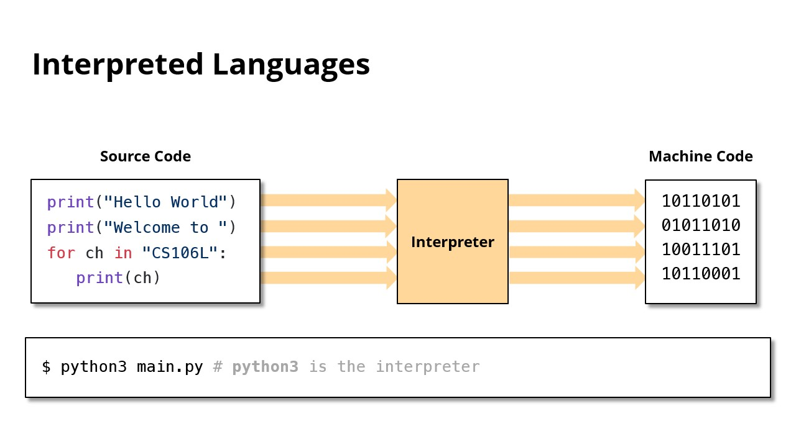

# Compile, 编译
{: .no_toc }

## Table of Contents
{: .no_toc .text-delta }

1. TOC
{:toc}

## Readings

- Slide: <https://web.stanford.edu/class/cs106l/lectures/03_Initialization&References.pdf>, p100-113

---

- C++ is a **compiled** language

---

## Why compile over interpret?

- It allows us to generate more efficient machine code!
	- Interpreters only see one small part of code at a time
	- Compilers see everything
- However, complication takes time!

---

## Compiling C++ Programs

- Everything you need to know about compiling a program for your first assignment.
- We’ll be making use of VSCode which makes C++ compilation quite easy.

- Source Code -> Compiler -> Machine Code
- C++ is a compiled language
- There are computer programs called **compilers**
- A few popular compilers include **clang** and **g++**
- **Here is how to compile a program using g++**
	- `g++ -std=c++11 main.cpp -o main`
		- `g++` - This is the compiler command
		- `-std=c++11` - This specifies the c++ version you want to compile in
			- `-std=c++98`：编译使用 C++98 标准
			- `-std=c++03`：编译使用 C++03 标准
			- `-std=c++11`：编译使用 C++11 标准
			- `-std=c++14`：编译使用 C++14 标准
			- `-std=c++17`：编译使用 C++17 标准
			- `-std=c++20`：编译使用 C++20 标准
			- `-std=c++23`：编译使用 C++23 标准（如果已支持）
		- `main.cpp` - This is the source file
		- `-o` - This means that you’re going to give a specific name to your executable
		- `main` - In this case it’s main
- This is also valid, your executable will be something like a.out
	- `g++ -std=c++11 main.cpp`

- This is all you need for now! We will talk about large project compilation in another lecture and explore things like **CMAKE** and **make**!

---

Last Updated: Wed Oct 23 18:28:09 CST 2024

