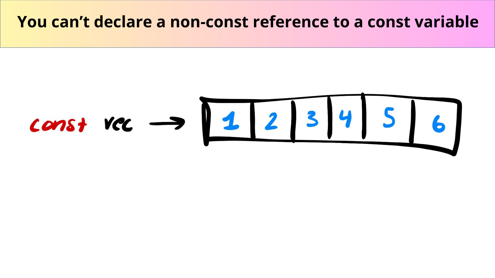
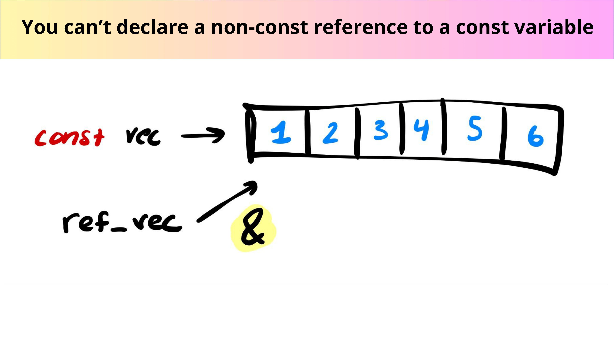
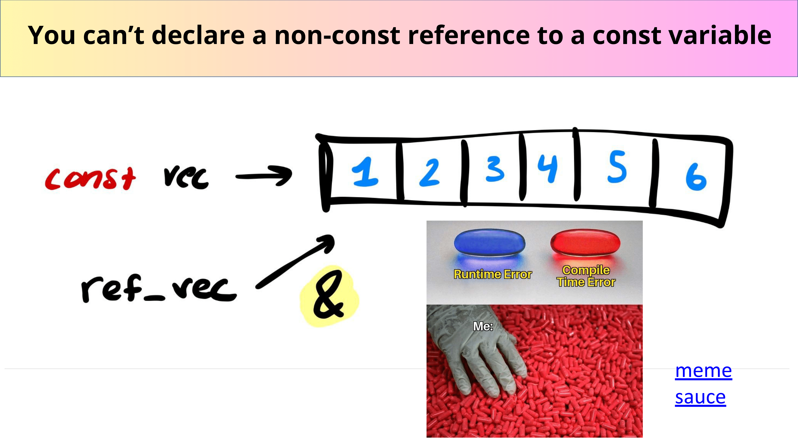

# Const

- **Const is a way to ensure that you can’t modify a variable**

---

- **What?:** A qualifier for objects that declares they cannot be modified – [cppreference.com](https://en.cppreference.com/w/cpp/language/cv)

```cpp
#include <iostream>
#include <vector>

int main()
{
    std::vector<int> vec{ 1, 2, 3 };                /// a normal vector
    const std::vector<int> const_vec{ 1, 2, 3 };    /// a const vector
    std::vector<int>& ref_vec{ vec };               /// a reference to 'vec'
    const std::vector<int>& const_ref{ vec };       /// a const reference
    
    vec.push_back(3);           /// this is ok!
    const_vec.push_back(3);     /// no, this is const!
    ref_vec.push_back(3);       /// this is ok, just a reference!
    const_ref.push_back(3);     /// this is const, compiler error!
    
    return 0;
}
```

- **You can’t declare a non-const reference to a const variable**

```cpp
#include <iostream>
#include <vector>

int main()
{
    /// a const vector
    const std::vector<int> const_vec{ 1, 2, 3 };
    std::vector<int>& bad_ref{ const_vec };         /// BAD
    
    return 0;
}
```







```cpp
#include <iostream>
#include <vector>

int main()
{
    /// a const vector
    const std::vector<int> const_vec{ 1, 2, 3 };
    const std::vector<int>& bad_ref{ const_vec };         /// Good!
    
    return 0;
}
```

---

Last Updated: Fri Oct 25 09:47:44 CST 2024
