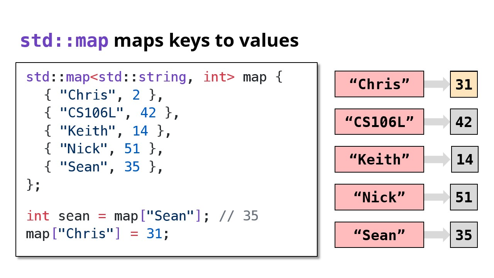

# Containers, 容器


---


> "Space is time"
> - Bjarne Stroustrup ([source](https://www.stroustrup.com/quotes.html))

## STL (Standard Template Library)

### WHY STL?

- Q: What are templates?

- A: I need a way to store lists of integers!
- B: I am on it!
- B: I’ve done it!

```cpp
class IntVector {
	// Code to store
	// a list of
	// integers...
};
```

- A: Now I need to store a list of **doubles**!
- B: Right on it!
- B: I’ve done it!

```cpp
class DoubleVector {
	// Code to store
	// a list of
	// doubles...
};
```

- **thats kinda sus**

- Q: What if we could keep the logic, but change the type?


```cpp
template <typename T>
class vector {
	// So satisfying.
};

vector<int> v1;
vector<double> v2;
vector<string> v3;
```

- All STL containers are **templates**!

### STL

- Created by Alexander Stepanov
- Added templates to C++ and built a well-known library
- This library is now known as the **STL**!


## Sequence Containers

- Sequence containers store a linear sequence of elements
- A linear sequence of elements
- `std::vector`, `std::deque`

### `std::vector`

```cpp
#include <vector>
```


```cpp
std::vector<int> vec { 1, 2, 3, 4 };
vec.push_back(5);
vec.push_back(6);
vec[1] = 20;

for (size_t i = 0; i < vec.size(); i++) {
	std::cout << vec[i] << " ";
}
```


source: https://en.cppreference.com/w/cpp/language/Zero-overhead_principle

- `std::vector` is not the best for all cases...
	- Suppose we need to observe the last 10,000 prices of a stock
	- What might be concerning about the code below?

```cpp
void receivePrice(vector<double>& prices, double price)
{
	prices.push_front(price);
	if (prices.size() > 10000)
		prices.pop_back();  // Remove last price
		                    // so we don't exceed 10k
}
```


### `std::deque`

```cpp
#include <deque>
```

- A deque (“deck”) is a double-ended queue
- Allows efficient insertion/removal at either end

```cpp
void receivePrice(deque<double>& prices, double price)
{
	prices.push_front(price);   // Super fast
	if (prices.size() > 10000)
		prices.pop_back();      // Remove last price
		                        // so we don't exceed 10k
}
```

- A `deque` has the same interface as `vector`, except we can `push_front` / `pop_front`


## Associative Containers

- Associative containers organize elements by unique keys
- A set of elements organized by unique keys
- `std::map`, `std::set`, `std::unordered_map`, `std::unordered_set`

### `std::map`

```cpp
#include <map>
```


- Equivalent of a Python dictionary
- Sometimes called an **associative array**




#### `map` as a collection of `pair`

We can iterate through the key-value pairs using a range based for loop

```cpp
std::map<std::string, int> map;

for (auto kv : map) {
	// `kv` is a `std::pair<const std::string, int>`
	std::string key = kv.first;
	int value = kv.second;
}
```

```cpp
// Structured bindings come in handy when iterating a map

std::map<std::string, int> map;

for (const auto& [key, value] : map) {
	// `key` has type `const std::string&`
	// `value` has type `const int&`
}
```


- `std::map<K, V>` requires `K` to have an operator `<`

```cpp
// ✅ OKAY - int has operator<
std::map<int, int> map1;

// ❌ ERROR - std::ifstream has no operator<
std::map<std::ifstream, int> map2;
```

### `std::set`

```cpp
#include <set>
```


- `std::set` is an amoral `std::map`
- `std::set` is an `std::map` without values


### `std::unordered_map` & `std::unordered_set`

```cpp
#include <unordered_map>
#include <unordered_set>
```

#### `std::unordered_map`

- You can think of `unordered_map` as an optimized version of `map`
- It has the same interface as `map`

```cpp
std::unordered_map<std::string, int> map {
	{ "Chris", 2 },
	{ "Nick", 51 },
	{ "Sean", 35 }
};

int seam = map["Sean"]; // 35
map["Chris"] = 31;
```


- `std::unordered_map<K, V>` requires `K` to be hashable

```cpp
// ✅ OKAY - int is hashable
std::unordered_map<int, int> map1;

// ❌ ERROR - std::ifstream is not hashable
std::unordered_map<std::ifstream, int> map2;
```

- Most basic types (`int`, `double`, `string`) are hashable by default.


### `std::unordered_set`


## Others


---

Last Updated: Fri Oct 25 13:35:47 CST 2024


