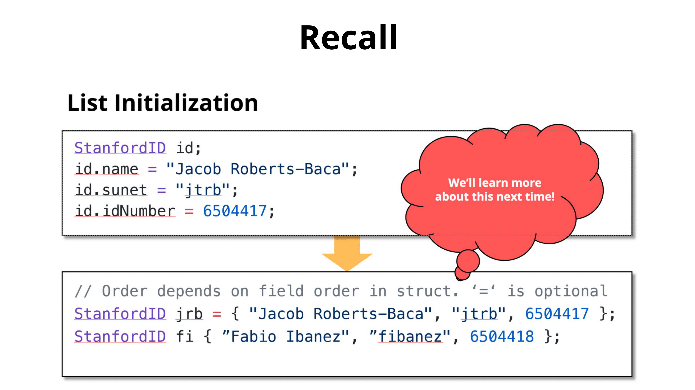

# Initialization, 初始化

- **What?:** “Provides initial values at the time of construction” - [cppreference.com](https://en.cppreference.com/w/cpp/language/initialization)
- **How? 🤔:**
	- **Direct** initialization
	- **Uniform** initialization (C++11)
	- **Structured Binding**

## 1/3 Direct initialization

```cpp
// Direct initialization
#include <iostream>

int main() {
	int numOne = 12.0;
	int numTwo(12.0);

	std::cout << "numOne is: " << numOne << std::endl;
	std::cout << "numTwo is: " << numTwo << std::endl;

	return 0;
}
```


- **Notice!!**: is `12.0` an `int`?
	- **NO: C++ Doesn't Care**

- **Problem?** 

```cpp
// Direct initialization
#include <iostream>

int main() {
    // Direct initialization with a floating-point value
    int criticalSystemValue(42.5);
    
    // Critical system operations...
    // ...
    
    std::cout << "Critical system value: " << criticalSystemValue << std::endl;

	return 0;
}
```


- **What happened?**
	- The user intended to save a float, 42.5, into `criticalSystemValue`
	- **C++ doesn’t care in this case**, it doesn’t type check with direct initialization
	- So C++ said “Meh, I’ll store 42.5 as an int,” and we possibly now have an error. This is commonly called a **narrowing conversion**

## 2/3 Uniform initialization (C++11)

```cpp
Student jacob { "Jacob", "NM", 21 }
```

- **Use uniform initialization — it works for all types and objects!**
- **A ubiquitous and safe way of initializing things using `{}`**

```cpp
// File: narrowing_conversion
// Uniform initialization
#include <iostream>

int main() {
	// Notice the brackets
	int numOne{12.0};
	float numTwo{12.0};

	std::cout << "numOne is: " << numOne << std::endl;
	std::cout << "numTwo is: " << numTwo << std::endl;

	return 0;
}
```


- **Notice!!**: the curly braces!
- With uniform initialization C++ **does** care about types!
- **Notice!!**: 12 instead of 12.0
	- ✅ `int numOne{12};`
	- ❌ `int numOne{12.0};`

- Uniform initialization (List Initialization) is awesome because:
	- It’s **safe**! It doesn’t allow for *narrowing conversions*—which can lead to unexpected behaviour (or critical system failures :o)
	- It’s **ubiquitous** it works for all types like vectors, maps, and custom classes, among other things!

```cpp
// Uniform initialization (Map) 

#include <iostream>
#include <map>

int main() {
	// Uniform initialization of a map
	std::map<std::string, int> ages {
		{"Alice", 25},
		{"Bob", 30},
		{"Charlie", 35}
	};

	// Accessing map elements
	std::cout << "Alice's age: " << ages["Alice"] << std::endl;
	std::cout << "Bob's age: " << ages.at("Bob") << std::endl;

	return 0;
}
```

```
Alice's age: 25
Bob's age: 30
```

---

```cpp
// Uniform initialization (Vector)

#include <iostream>
#include <vector>

int main() {
	// Uniform initialization of a vector
	std::vector<int> numbers{1, 2, 3, 4, 5};

	// Accessing vector elements
	for (int num : numbers) {
		std::cout << num << " ";
	}
	std::cout << std::endl;

	return 0;
}
```

```
1 2 3 4 5
```



## 3/3 Structured Binding (C++ 17)

```cpp
auto [first, second] = p;
```

- A useful way to initialize some variables from data structures with fixed sizes at compile time
- Ability to access multiple values returned by a function
- Can use on objects where the size is **known at compile-time**

```cpp
// Structured Binding (C++ 17)

std::tuple<std::string, std::string, std::string> getClassInfo() {
	std::string className = "CS106L";
	std::string buildingName = "Thornton 110";
	std::strinmg language = "C++";
	return {className, buildingName, language};
}

int main() {
	auto [className, buildingName, language] = getClassInfo();
	std::cout << "Come to " << buildingName << " and join us for " << className << " to learn " << language << "!" << std::endl;

	return 0;
}
```

```cpp
// Structured Binding (C++ 17)

#include <iostream>
#include <tuple>
#include <string>

std::tuple<std::string, std::string, std::string> getClassInfo() {
	std::string className = "CS106L";
	std::string buildingName = "Thornton 110";
	std::string language = "C++";
	return {className, buildingName, language}; // Notice - uniform initialization
}

int main() {
    auto classInfo = getClassInfo();
    std::string className = std::get<0>(classInfo);
    std::string buildingName = std::get<1>(classInfo);
    std::string language = std::get<2>(classInfo);
    
	std::cout << "Come to " << buildingName << " and join us for " << className << " to learn " << language << "!" << std::endl;

	return 0;
}
```

```
Come to Thornton 110 and join us for CS106L to learn C++!
```

```cpp
auto classInfo = getClassInfo();
std::string className = std::get<0>(classInfo);
std::string buildingName = std::get<1>(classInfo);
std::string language = std::get<2>(classInfo);
```

->

```cpp
auto [className, buildingName, language] = getClassInfo();
```

---

Last Updated: Fri Oct 25 09:08:15 CST 2024

