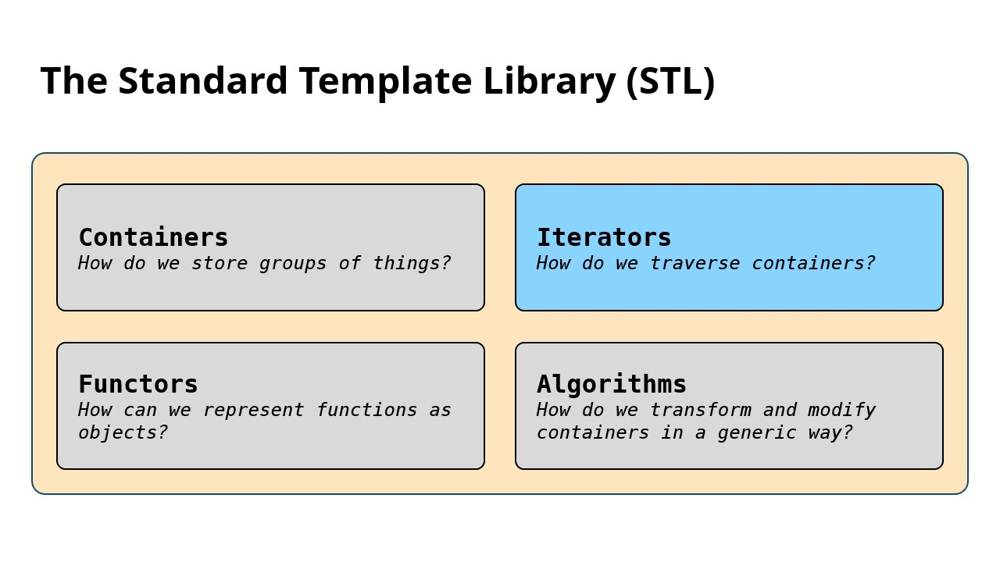
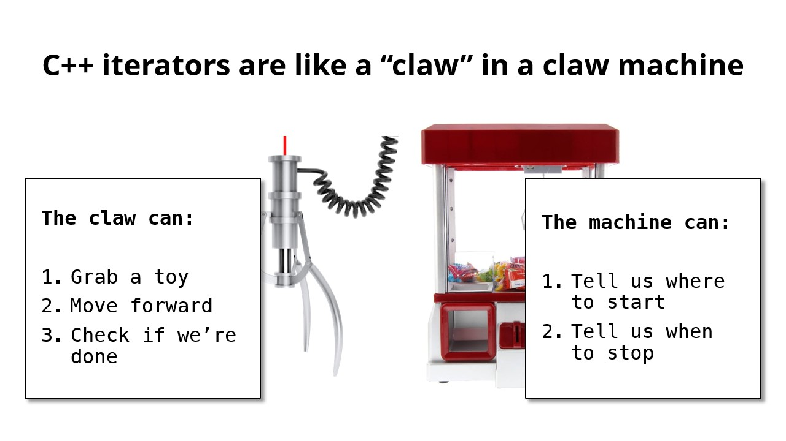
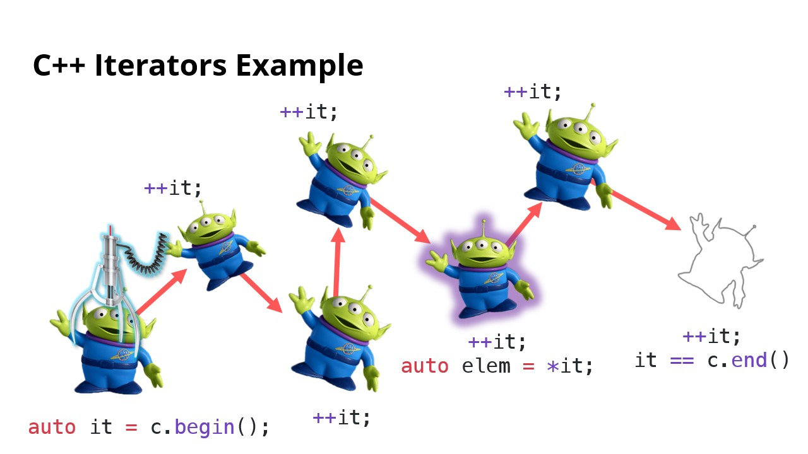
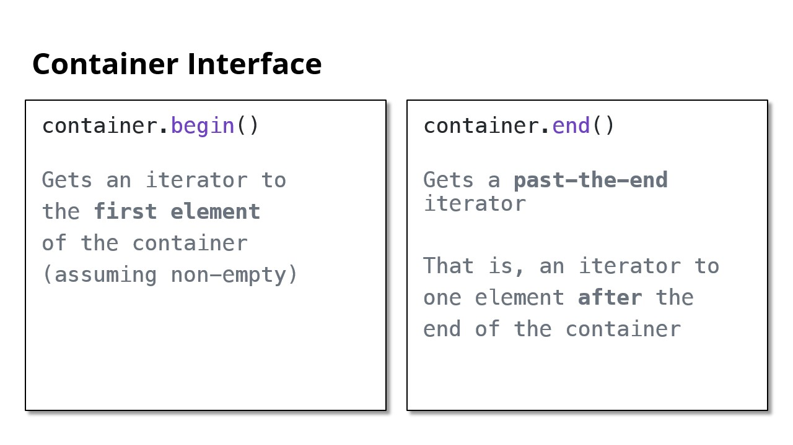
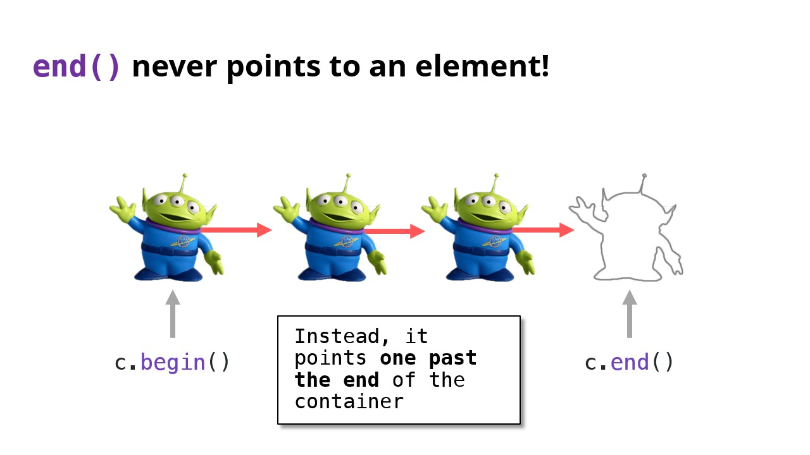
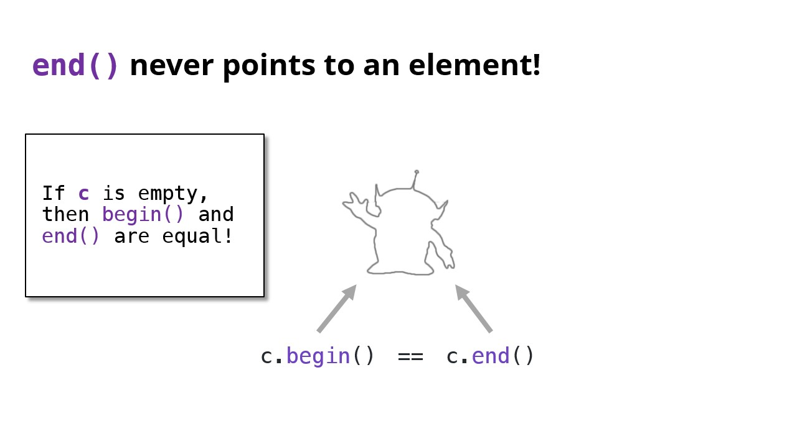
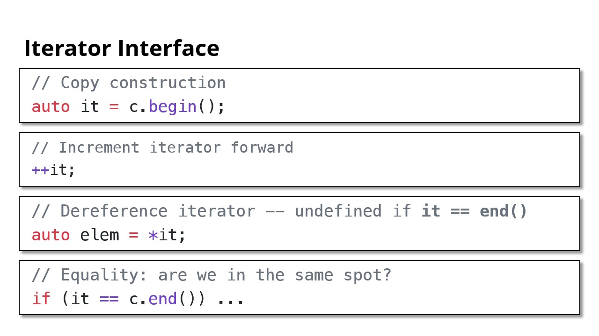

# Iterators, 迭代器



## Iterator Basics

Q: How do we iterate?

```cpp
std::vector<int> v {1, 2, 3, 4};
for (size_t i = 0; i < v.size(); i++) {
	const auto& elem = v[i];
}

for (var-init; condition; increment) {
	const auto& elem = /* grab element */;
}

std::set<int> s {1,2,3,4};
for (uhhh; ummm; what?) {
	const auto& elem = /* haeelp :( :( */;
}
```

- `for (auto e : s)` is not allowed ... for now

- We need something to track **where we are** in a container… sort of like an index
- Introducing **iterators**
- **C++ iterators are like a “claw” in a claw machine**





- Containers and iterators **work together** to allow iteration









```cpp
// Copy constrcution
auto it = c.begin();
// Increment iterator forward
++it;
// Dereference iterator -- undefined if `it == end`
```

---

Last Updated: 