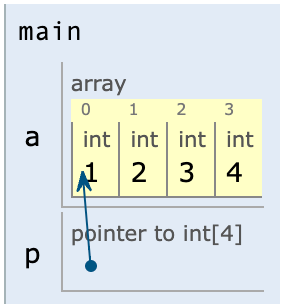

# Lec 05

## 1. 一维指针

```cpp
*a++ = i;

void func(int a[10]);
void print(int* a);
```

- 指针和数组名可以互换。

## 2. 引用

- **作用**：给变量起别名（外号）
- **语法**：`数据类型 &别名 = 原名`
- 引用**必须初始化**
- 引用在初始化后，**不可以改变**
- 比指针更直观，可以简化思考

---

```cpp
#include <iostream>
using namespace std;

int main() {
	int a = 10;
	int& b = a; // 给 a 起别名 b
	cout << "a = " << a << endl;
	cout << "b = " << b << endl;
  
	b = 100;
	cout << "a = " << a << endl;
	cout << "b = " << b << endl;
  
	return 0;
}
```


---

```cpp
#include <iostream>
using namespace std;

int main() {
	int a = 10;
	int b = 20;
	// int& c;     // 错误：引用必须初始化
	int& c = a; // 引用在初始化后，不可以改变
	c = b;

	cout << "a = " << a << endl;
	cout << "b = " << b << endl;
	cout << "c = " << c << endl;
  
	return 0;
}
```

---

**引用的本质**

```cpp
int& ref = a; // int* const ref = &a;
ref = 20; // ref->引用，自动转换：*ref = 20
```

- const 可以防止误操作

```cpp
const int* arr
```

- `arr` 被很多子程序使用，防止篡改

## 3. 二维指针

- 考虑和二维数组结合使用

## 4. 多维数组的地址

传参的时候注意下面的内容：

- **等级**：一级地址 二级地址 取值
- **基类型**
	- 二级地址的基类型是，一维数组
	- 一级地址的基类型是，一个数组元素

```cpp
// 降级
// []
// *

// 升级
// &
```

- 有几个 `*` 就代表降几级，有几个 `[]` 也代表降几级

```cpp
int* arr[10];
int (*arr)[10]; // 相当于一个二级地址
```

```cpp
#include <iostream>
using namespace std;

int main()
{
    int a[4] = {1, 2, 3, 4};
    int (*p)[4];
    
    p = &a;
    cout << (*p)[3] << endl;
    
    return 0;
}
```

```cpp
#include <iostream>
using namespace std;

int main()
{
    int a[4] = {1, 2, 3, 4};
    int (*p)[4];
    
    p = &a;
    cout << (*p)[3] << endl;
    
    return 0;
}
```



```
int max_value(int array[][4])   // right: 基类型 int[4]
int max_value(int (*array)[4])  // right: 基类型 int[4]
int max_value(int **array)      // wrong
int max_value(int array[][])    // wrong
```

- 基类型强调一种跨度

## 5. 函数的指针

- 不考虑级别，没有一维函数、二维函数

```cpp
int (*p) (int, int); // 有 2 个 int 参数，并且返回值类型也是 int 的函数指针
int* p(int, int);
```

- 函数名，也是一个被锁定的指针，是指向函数的一个入口

```cpp
int (*p)(int, int);

c = p(a, b);
c = (*p)(a, b);
```

- 函数的基类型：参数类型、个数，返回类型

## 6. 字符串与指针

```cpp
char* str = "read-only storage"
```

- 常量存储区，只能读，不能写
- 自己开辟的内存空间存放在 heap 堆里

## 7. 结构体


- 和 C 的结构体 90% 相同
- 打包各种基础数据类型，自定义新的、更加复杂的数据类型
- 个性化、自定义
- 步骤
	- 做结构体，造
	- 声明、使用
- 用起来有点像二维表
- 和一般的 `int` 之类差不多

## 8. 结构体嵌套结构体

- `t1.student.num`

## 9. 结构体作为参数


---

Last Updated: Thu Oct 10 08:14:56 CST 2024
