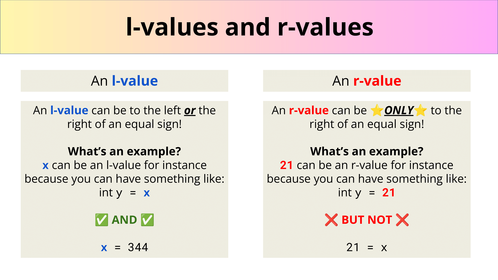

# L-values vs R-values, 左值右值



## l-value and r-value PAIN

```cpp
// File: lvalue_pain
#include <stdio.h>
#include <cmath>
#include <iostream>

int squareN(int& num) {
    return std::pow(num, 2);
}

int main()
{
    int lValue = 2;
    auto four = squareN(lValue);
    auto fourAgain = squareN(2);
    std::cout << four << std::endl;
    return 0;
}
```

- **is `int& num` an l-value?**
	- It turns out that `num` is an l-value! But Why?
		- Remember what we said about r-values are temporary. Notice that num is being passed in by reference!
		- We **cannot** pass in an r-value by reference because they’re temporary!
- Well what happens?


---

Last Updated: Fri Oct 25 09:36:29 CST 2024

