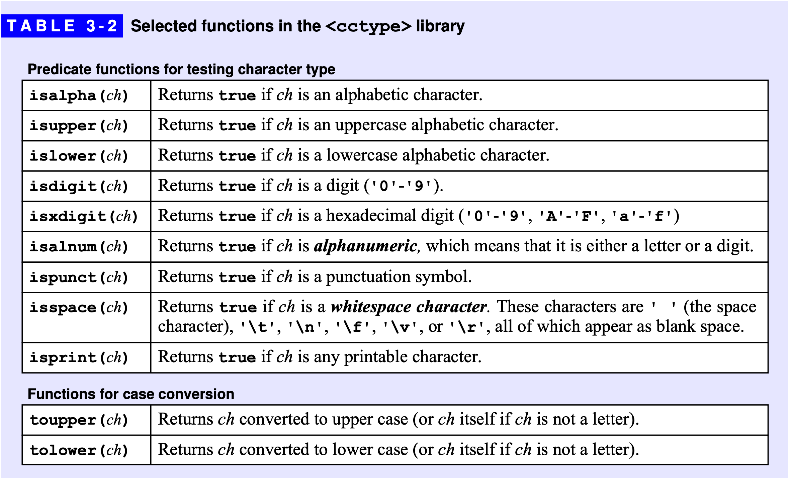
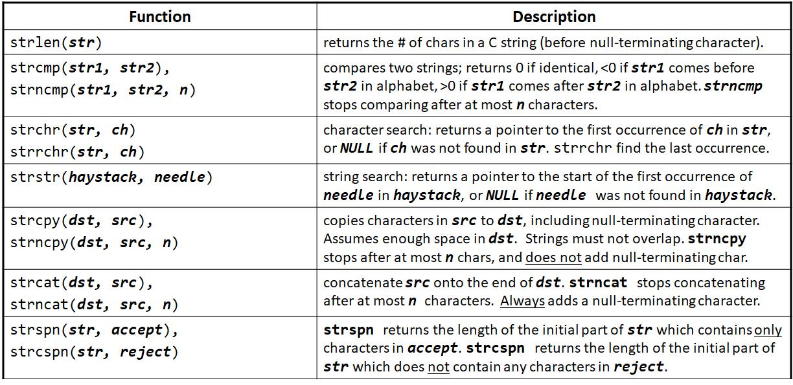
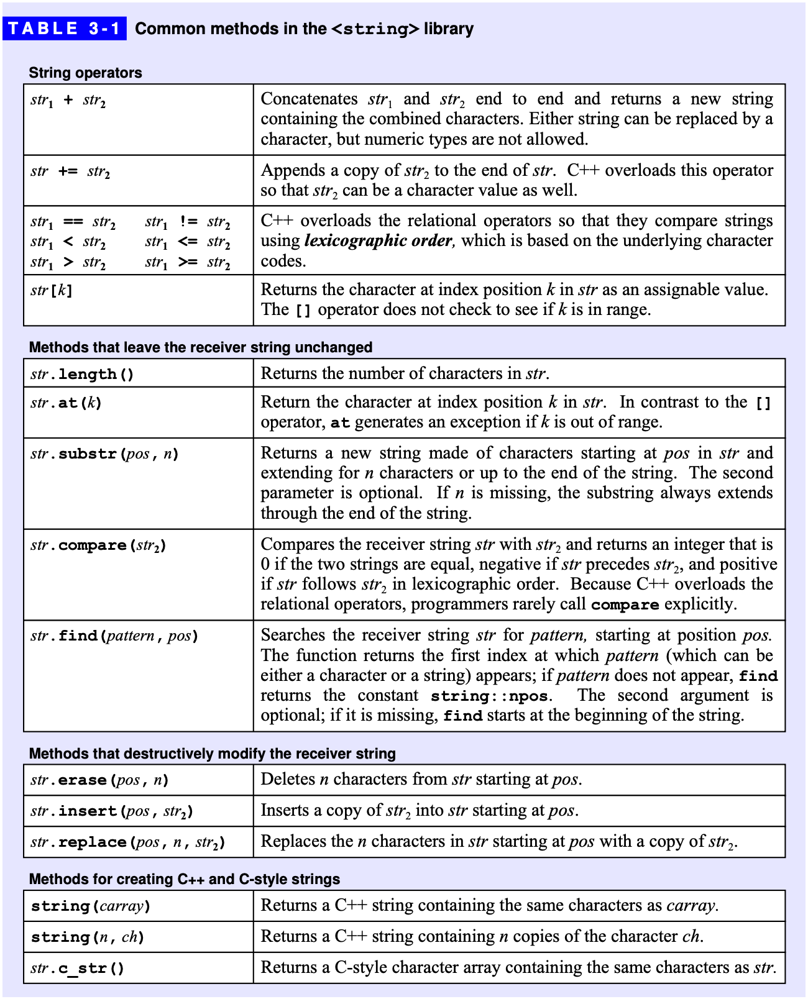

# Strings
{: .no_toc }

## Table of Contents
{: .no_toc .text-delta }

1. TOC
{:toc}

## Characters & ASCII, 字符 & 美国信息交换标准代码


- [ASCII](https://en.wikipedia.org/wiki/ASCII) (American Standard Code for Information Interchange)
	- 字符与整数的联系
	- 每个常用字符都对应一个 `-128 ~ 127` 的数字，二者之间可以相互转化
	- 负数没有与之对应的字符

```cpp
#include <iostream>

using namespace std;

int main()
{
    char c = 'a';
    cout << (int)c << endl;

    int a = 66;
    cout << (char)a << endl;

    return 0;
}
```

**常用 ASCII 值**

- `0-9: [48, 57]`
- `A-Z: [65, 90]`
- `a-z: [97, 122]`

字符可以参与运算，运算时会将其当做整数：

```cpp
#include <iostream>

using namespace std;

int main()
{
    int a = 'B' - 'A';
    int b = 'A' * 'B';
    char c = 'A' + 2;

    cout << a << endl;
    cout << b << endl;
    cout << c << endl;

    return 0;
}
```

{: .note-title }
> 练习 
>
> 输入一行字符，统计出其中数字字符的个数，以及字母字符的个数。

## `<cctype>`



## Character Arrays, 字符数组

- 字符串结束符：`\0` 
- 字符数组加上字符串结束符 `\0` 就是字符串
- 字符串可以来初始化字符数组，但此时要注意，每个字符串结尾会暗含一个 `\0` 字符，因此字符数组的长度至少要比字符串的长度多 1 ！

```cpp
#include <iostream>

using namespace std;

int main()
{
    char a1[] = {'C', '+', '+'};            // 列表初始化，没有空字符
    char a2[] = {'C', '+', '+', '\0'};      // 列表初始化，含有显示的空字符
    char a3[] = "C++";                      // 自动添加表示字符串结尾的空字符
    char a4[6] = "Daniel";                  // 错误：没有空间可以存放空字符

    return 0;
}
```

### Input & Output, 输入输出

```cpp
#include <iostream>

using namespace std;

int main()
{
    char str[100];

    cin >> str;             // 输入字符串时，遇到空格或者回车就会停止
    cout << str << endl;    // 输出字符串时，遇到空格或者回车不会停止，遇到'\0'时停止
    printf("%s\n", str);

    return 0;
}
```

读入一行字符串，包括空格：

- `cin` 输入字符串无法输入空格
- 那我想输入带空格的字符串怎么办？
- 可以用 `gets()`
- 可是 `gets()` 由于安全问题在新版C++中被移除了
- 那可以试试 `fgets()`，但是请注意，`fgets()` 会保留行末的回车字符

```cpp

#include <iostream>

using namespace std;

int main()
{
    char str[100];

    fgets(str, 100, stdin);  // gets函数在新版C++中被移除了，因为不安全。
                             // 可以用fgets代替，但注意fgets不会删除行末的回车字符

    cout << str << endl;

    return 0;
}
```

### Operations, 操作

- `#include <string.h>`



```cpp
#include <iostream>
#include <string.h>

using namespace std;

int main()
{
    char a[100] = "hello world!", b[100];

    cout << strlen(a) << endl;

    strcpy(b, a);

    cout << strcmp(a, b) << endl;

    return 0;
}
```

遍历字符数组中的字符：

```cpp
#include <iostream>
#include <string.h>

using namespace std;

int main()
{
    char a[100] = "hello world!";

    // 注意：下述for循环每次均会执行strlen(a)，运行效率较低，最好将strlen(a)用一个变量存下来
    for (int i = 0; i < strlen(a); i ++ )
        cout << a[i] << endl;

    return 0;
}
```

{: .note-title }
> 练习 
>
> 给定一个只包含小写字母的字符串，请你找到第一个仅出现一次的字符。如果没有，输出no。

{: .note-title }
> 练习 
>
> 把一个字符串中特定的字符全部用给定的字符替换，得到一个新的字符串。

## `<string>`

- `#include <string>`



### String Initialization, 字符串初始化

```cpp
#include <iostream>
#include <string>

using namespace std;

int main()
{
    string s1;              // 默认初始化，s1是一个空字符串
    string s2 = s1;         // s2是s1的副本，注意s2只是与s1的值相同，并不指向同一段地址
    string s3 = "hiya";     // s3是该字符串字面值的副本
    string s4(10, 'c');     // s4的内容是 "cccccccccc"

    return 0;
}
```

### Input & Output, 输入输出

```cpp
#include <iostream>
#include <string>

using namespace std;

int main()
{
    string s1, s2;

    cin >> s1 >> s2;
    cout << s1 << s2 << endl;

    return 0;
}
```

{: .highlight-title}
> 注意
> 
> 不能用 `printf` 直接输出 string，需要写成：`printf("%s", s.c_str())`;

**`getline()`**

```cpp
#include <iostream>
#include <string>

using namespace std;

int main()
{
    string s;

    getline(cin, s);

    cout << s << endl;

    return 0;
}
```

### String Operations, 字符串操作

**`str.empty()` & `str.size()`**

- 注意 `size` 是无符号整数，因此 `s.size() <= -1` 一定成立

```cpp
#include <iostream>
#include <string>

using namespace std;

int main()
{
    string s1, s2 = "abc";

    cout << s1.empty() << endl;
    cout << s2.empty() << endl;

    cout << s2.size() << endl;

    return 0;
}
```

**Compare, 比较**

- String operators (字符串操作符): `==`, `!=`, `<`, `<=`, `>`, `>=`
- String method (字符串方法)
	- `str.compare(str2)`

**Assignment, 赋值**

- String operators (字符串操作符): `=`
- String method (字符串方法)
	- `str(n, ch)`: returns a C++ string containing `n` copies of the character `ch`.

```cpp
string s1(10, 'c'), s2;     // s1的内容是`cccccccccc`；s2是一个空字符串
s1 = s2;                    // 赋值：用s2的副本替换s1的副本
                            // 此时s1和s2都是空字符串
```

**Growing a string through concatenation, 拼接**

- String operators (字符串操作符): `+`, `+=`

```cpp
string s1 = "hello, ", s2 = "world\n";
string s3 = s1 + s2;                    // s3的内容是`hello, world\n`
s1 += s2;                               // s1 = s1 + s2
```

拼接字符串时，字面值和字符都会被转化成 `string` 对象，直接相加即可：

```cpp
string s1 = "hello", s2 = "world";      // 在s1和s2中都没有标点符号
string s3 = s1 + ", " + s2 + '\n';
```

当把 `string` 对象和字符字面值及字符串字面值混在一条语句中使用时，必须确保每个 `+` 两侧的运算对象至少有一个是 `string`：

```cpp
string s4 = s1 + ", ";  // 正确：把一个string对象和有一个字面值相加
string s5 = "hello" + ", "; // 错误：两个运算对象都不是string

string s6 = s1 + ", " + "world";  // 正确，每个加法运算都有一个运算符是string
string s7 = "hello" + ", " + s2;  // 错误：不能把字面值直接相加，运算是从左到右进行的
```

**Iterating through the characters in a string, 字符串遍历**

可以将 `string` 对象当成字符数组来处理：

```cpp
#include <iostream>
#include <string>

using namespace std;

int main()
{
    string s = "hello world";

    for (int i = 0; i < s.size(); i ++ )
        cout << s[i] << endl;

    return 0;
}
```

或者使用基于范围的for语句：

```cpp
#include <iostream>
#include <string>

using namespace std;

int main()
{
    string s = "hello world";

    for (char c: s) cout << c << endl;

    for (char& c: s) c = 'a';

    cout << s << endl;

    return 0;
}
```

{: .note-title }
> 练习 1
>
> 密码翻译，输入一个只包含小写字母的字符串，将其中的每个字母替换成它的后继字母，如果原字母是'z'，则替换成'a'。

{: .note-title }
> 练习 2
>
> 输入两个字符串，验证其中一个串是否为另一个串的子串。

## Readings

- <https://cs102doc.stickmind.com/topic_2/string/index.html>
- <https://cs101.stickmind.com/static_files/presentations/lect_05.pdf>
- <https://web.stanford.edu/class/archive/cs/cs106b/cs106b.1252/lectures/03-strings/>
- <https://www.acwing.com/file_system/file/content/whole/index/content/3589702/>

---

Last Updated: Fri Oct  4 14:11:04 CST 2024

