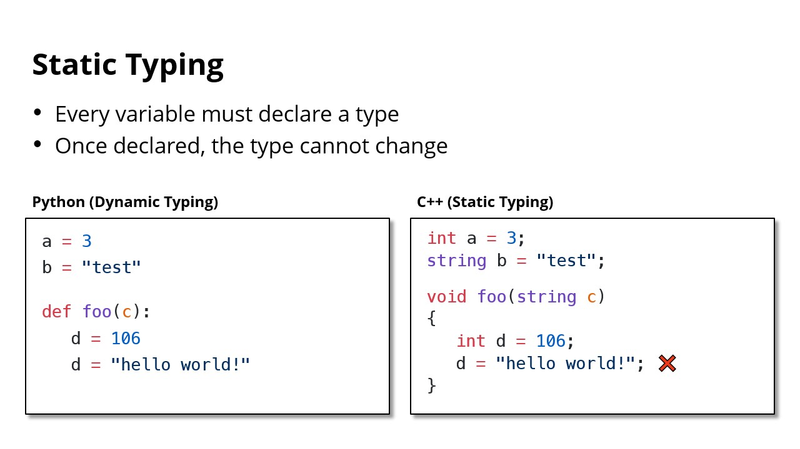
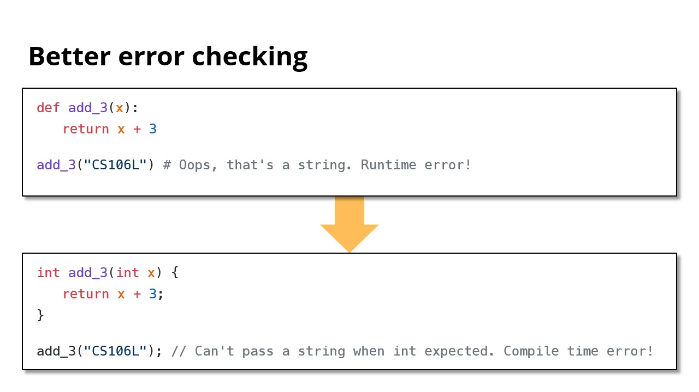
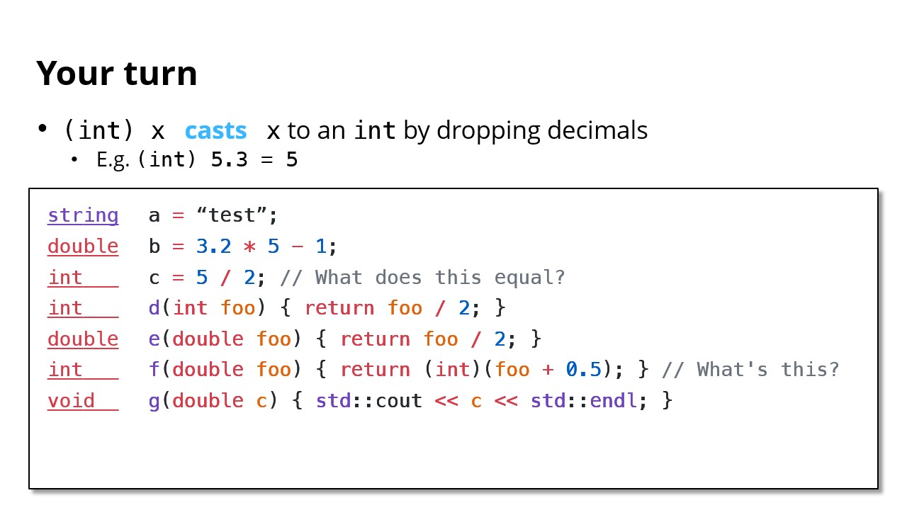
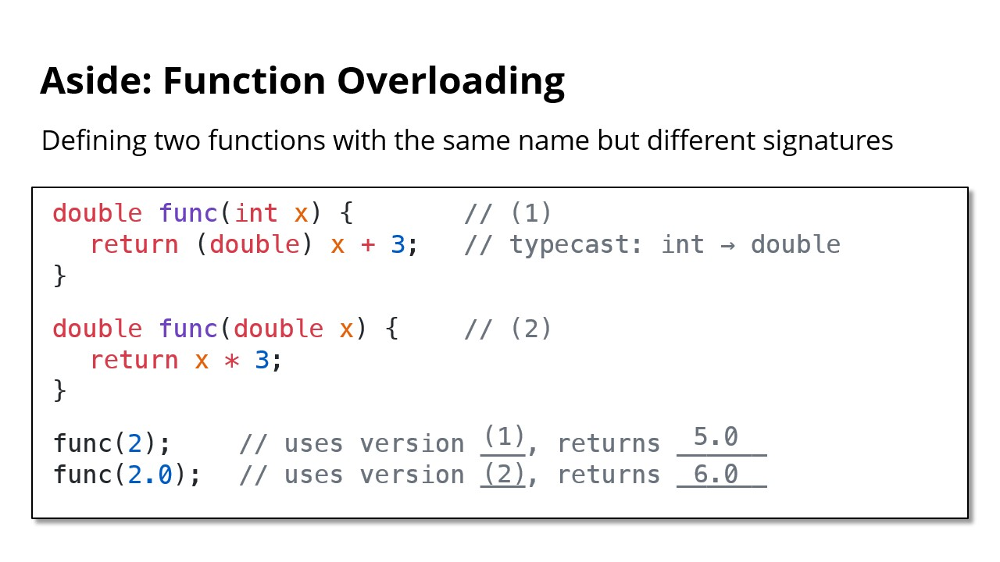

# Type, 类型

- A **type** refers to the “category” of a variable
- C++ comes with built-in types

```cpp
int 106
double 71.4
string "Welcome to C++!"
bool true, false
size_t 12 // Non-negative
```

- C++ is a compiled, **statically typed** language

## Static Typing

- Every variable must declare a type
- Once declared, the type cannot change
- WHY?
	- More efficient
	- Easier to understand and reason about
	- Better error checking





## Type Conversion





---

Last Updated: Wed Oct 23 18:35:33 CST 2024


