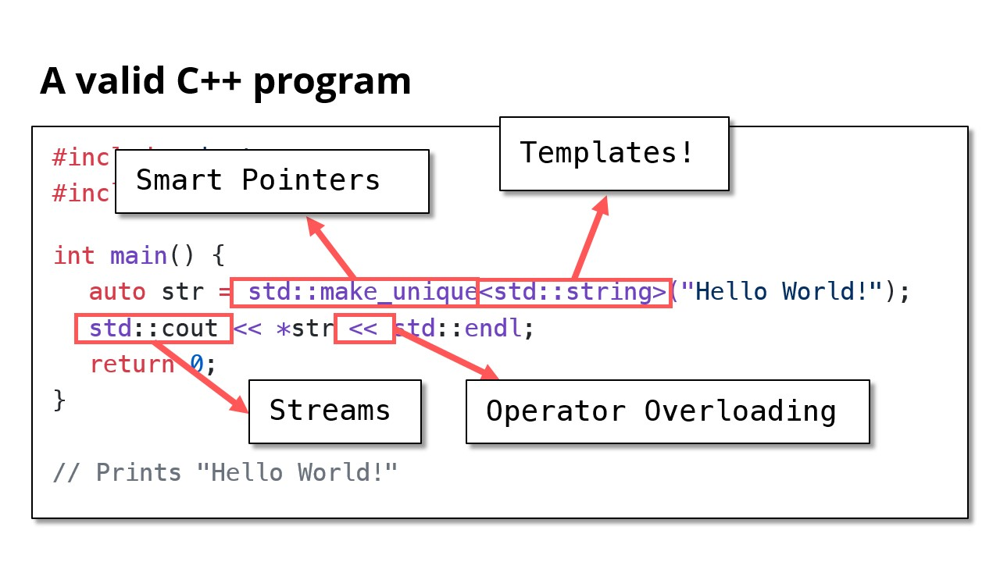

# Welcome to C++!

## A valid C++ program

```cpp
#include <iostream>
#include <string>

int main() {
	auto str = std::make_unique<std::string>("Hello World!");
	std::cout << *str << std::endl;
	return 0;
}

// Prints "Hello World!"
```



## Also a valid C++ program

- C++ is backwards compatible with C. Neat!

```cpp
#include "stdio.h"
#include "stdlib.h"

int main(int argc, char *argv) {
	printf("%s", "Hello, world!\n");
	// ^a C function!
	return EXIT_SUCCESS;
}
```

## Also a valid C++ program

TODO
```cpp

```

## C++ Design Philosophy

- Express ideas and intent directly in code.
- Enforce safety at compile time whenever possible.
- Do not waste time or space.
- **Compartmentalize** messy constructs.
- Allow the programmer full control, responsibility, and choice.

> "Code should be elegant **and** efficient; I hate to have to choose between those"
> —Bjarne Stroustrup

- C++ Design Philosophy (Summarized)
	- Readable
	- Safety
	- Efficiency
	- Abstraction
	- Multi-paradigm

> “Nobody should call themselves a professional if they only know one language”
> —Bjarne Stroustrup

## C++ helps develop good coding hygiene

- Am I using objects the way they’re meant to be used?
	- Type checking, type safety
- Am I using memory efficiently?
	- Reference/copy semantics, move semantics
- Am I modifiying something I’m not supposed to?
	- const and const correctness
- Other languages relax these restrictions

## Structure of a C++ Program

```cpp
// Include other libraries, similar to Python's "import"
#include <iostream>
#include <utility>
#include <cmath>

// Main logic of your program goes here
int main() {
	std::cout << "Hello World" << std::endl;
	std::cout << "Welcome to " << std::endl;
	for (char ch : "CS106L") {
		std::cout << ch << std::endl;
	}
}
```

```python
# python
print("Hello World")
print("Welcome to )
for ch in "CS106L":
	print(ch)
```


---

Last Updated: Wed Oct 23 17:10:51 CST 2024
