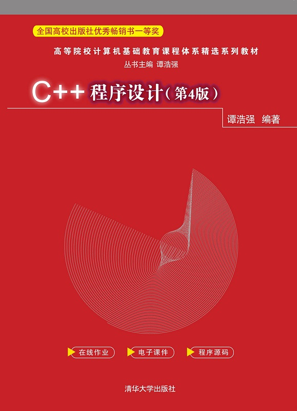

# Textbooks, 教材

## 课程教材

-   [谭浩强.C++程序设计:第4版[M].北京:清华大学出版社,2021.](http://www.tup.tsinghua.edu.cn/booksCenter/book_09067402.html)

	

## 其他教材

-   [Eric S. Roberts.Programming Abstractions in C++[M].](https://web.stanford.edu/class/archive/cs/cs106b/cs106b.1252/resources/textbook.html)

	
	
	

---

Last Updated: Tue Oct  1 09:30:50 CST 2024